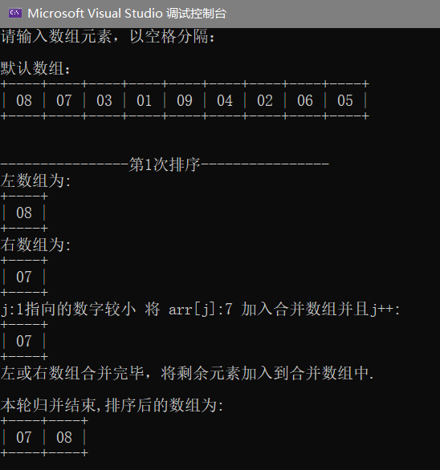
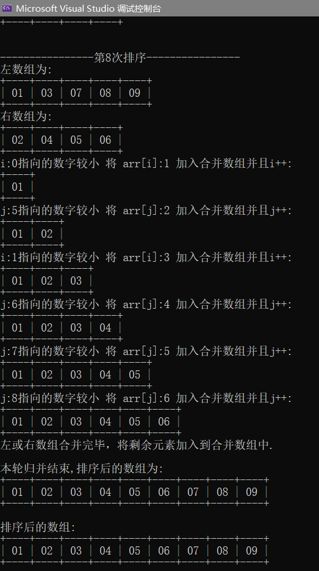
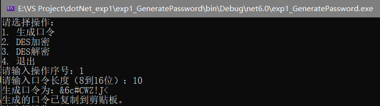
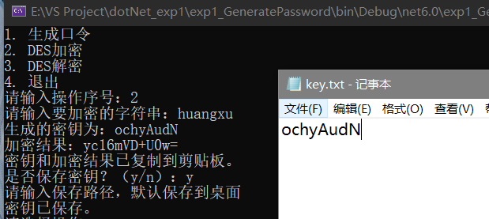
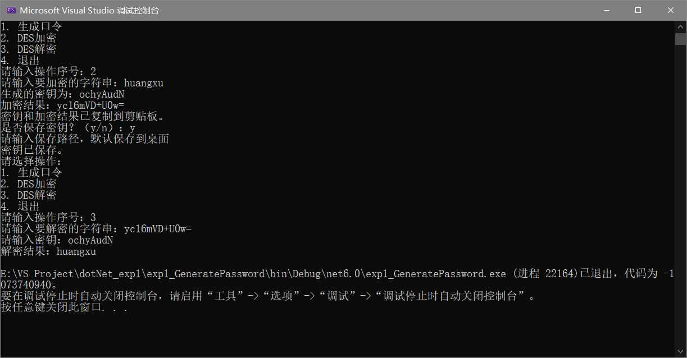
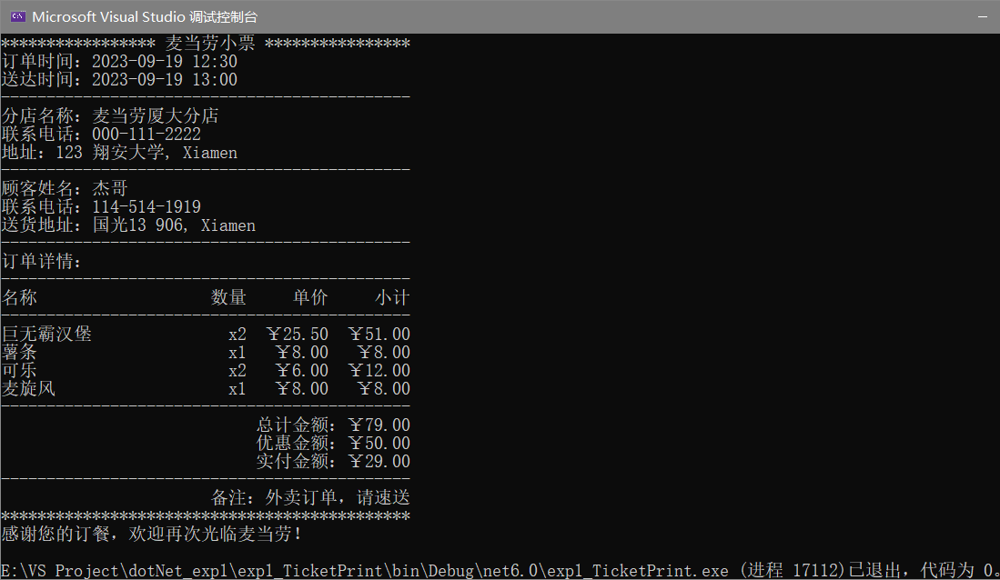

# .NET平台技术——实验一

​																22920212204392 黄勖

## 更新文件说明：归并排序

### 实现内容说明

编写的代码在 `./SortPrensentation.cs` 中

1. 用户输入

   - 用户被提示输入一个整数数组，以空格分隔。
   - 如果用户未输入任何内容（即只按下回车键），则程序将使用默认的整数数组。
   - 如果用户输入了数字，程序将解析这些数字并存储在整数数组 `arr` 中。

2. 输入验证

   - 程序会检查输入的合法性，包括是否有大于99的数字以及是否有重复元素（不便展示过程）。

3. 归并排序

   - 使用递归的归并排序算法对数组进行排序。
   - 归并排序的**具体过程会被展示，包括每次分割数组、合并数组的过程**。

   - 使用 `PrintArray` 方法以表格形式输出数组，使用户能够看到排序的每个步骤。

4. 递归结束

   - 归并排序递归结束后，排序后的数组将被展示。

### 运行代码截图





### 关键代码说明

1. **检查输入合法性**：

   ```c#
   for (int i = 0; i < arr.Length; i++)
   {
       // 检查是否有超过99的数
       if (arr[i] > 99)
       {
           Console.WriteLine("数组中不能有大于99的数，否则不便于展示排序过程！");
           return;
       }
       for (int j = i + 1; j < arr.Length; j++)
       {
           if (arr[i] == arr[j])
           {
               Console.WriteLine("数组中不能有重复元素，否则不便于展示排序过程！");
               return;
           }
       }
   }
   ```

2. **可视化展示**：

   ```c#
       //以表格形式输出数组
       static void PrintArray(int[] arr)
       {
           for (int i = 0; i < arr.Length; i++) Console.Write("+----");
           Console.WriteLine("+");
           for (int i = 0; i < arr.Length; i++) Console.Write($"|{arr[i],3:00} ");
           Console.WriteLine("|");
           for (int i = 0; i < arr.Length; i++) Console.Write("+----");
           Console.WriteLine("+");
       }
   ```

   `PrintArray` 函数以表格形式输出数组，用于展示每一步排序后的数组状态。

3. **排序内核部分**：

   ```c#
   static void MergeSort(int[] arr, int left, int right)
       {
           if (left >= right)return;
           int mid = (left + right)/2;
           MergeSort(arr, left, mid);
           MergeSort(arr, mid + 1, right);
           Console.WriteLine();
           Console.WriteLine($"------------第{count}次排序------------");
           count++;
           Console.WriteLine("左数组为:");
           PrintArray(arr, left, mid);
           Console.WriteLine("右数组为:");
           PrintArray(arr, mid + 1, right);
   
           int[] result = new int[right-left+1];
           int k = 0, i = left, j = mid + 1;
   
           while (i <= mid && j <= right)
           {
               if (arr[i] <= arr[j])
               {
                   Console.WriteLine($"i:{i}指向的数字较小 将 arr[i]:{arr[i]} 加入合并数组并且i++:");
                   result[k++] = arr[i++];
                   PrintArray(result, 0, k - 1);
               }
               else
               {
                   Console.WriteLine($"j:{j}指向的数字较小 将 arr[j]:{arr[j]} 加入合并数组并且j++:");
                   result[k++] = arr[j++];
                   PrintArray(result, 0, k - 1);
               }
           }
           if(i != mid || j != right)
           {
               Console.WriteLine("左或右数组合并完毕，将剩余元素加入到合并数组中.");
               while (i <= mid) result[k++] = arr[i++];
               while (j <= right) result[k++] = arr[j++];
               Console.WriteLine();
           }
           for (i = left, j = 0; i <= right; ++i, ++j)
           {
               arr[i] = result[j];
           }
   
           Console.WriteLine("本轮归并结束,排序后的数组为:");
           PrintArray(arr, left, right);
           Console.WriteLine();
       }
   ```

## 心得

这次实验确实让我感受到实验中的很多坑，并且在犯错误的同时提高了自己的需求理解分析能力和代码编写能力，这是一次很有意义的实验。

## 上一次提交提交内容说明

本实验压缩包提交的内容如下：

- `exp1_***(文件夹)` 三个Visual Studio对应工程

- `GeneratePassword.cs` 第一题C#代码
- `SortPrensentation.cs` 第二题C#代码
- `TicketPrint.cs` 第三题C#代码
- `Readme.md` 本说明
- `*.jpg` 代码运行截图

## 第一题：随机口令生成

### 实现内容说明

编写了一个简单的菜单，让用户选择以下操作：**生成口令**、**DES加密**、**DES解密**和退出。程序包含以下功能：

1. **生成口令**：用户输入口令长度*（8到16位）*，程序生成一个包含大小写字母、数字和特殊字符的随机口令。生成的口令会被复制到剪贴板。

   同时，本功能项还实现了将**==iIlL0O*.==**字符排除，避免在口令生成中产生这些字符。

2. **DES加密**：用户输入要加密的字符串，程序生成一个随机密钥，并使用DES算法对输入的字符串进行加密。加密结果和密钥会被复制到剪贴板。用户还可以选择将密钥保存到文档中。

3. **DES解密**：用户输入要解密的字符串和密钥，程序使用DES算法对输入的字符串进行解密。解密结果会被复制到剪贴板。

### 运行代码截图

#### 生成口令功能



#### 加密功能



#### 解密功能



### 关键代码说明

​	程序使用了`System.Security.Cryptography`命名空间中的`RNGCryptoServiceProvider`类生成随机数，`DESCryptoServiceProvider`类进行DES加密和解密。此外，程序还使用了`user32.dll`中的`OpenClipboard`、`CloseClipboard`和`SetClipboardData`函数将文本复制到剪贴板。

```c#
    static void SetClipboardText(string text) //复制到剪贴板
    {
        OpenClipboard(IntPtr.Zero);
        var ptr = Marshal.StringToHGlobalUni(text);
        SetClipboardData(13, ptr); // 13 表示CF_UNICODETEXT
        CloseClipboard();
        Marshal.FreeHGlobal(ptr);
    }
```

## 第三题：超市小票打印

### 实现内容说明

编写了一个简单的麦当劳小票打印程序，用于生成和打印订单小票。

具体完成情况见图。

### 运行代码截图



### 关键代码说明

1. **命名空间和类定义**：代码开始定义了一个命名空间 `TicketPrint`，内部包含了一个名为 `McDonaldsReceipt` 的类。

2. **内部类定义**：`McDonaldsReceipt` 类内部定义了三个内部类：`Restaurant`、`Item` 和 `Customer`，分别用于表示餐厅信息、订单中的商品信息和顾客信息。

3. ==**解决中英文混排问题**：代码定义了两个辅助函数 `padLeftEx` 和 `padRightEx`，用于解决中英文混排问题。这些函数会根据字符的字节长度来填充字符串，确保字符串在输出时对齐。==

   ```c#
       static string padLeftEx(string str, int totalByteCount) //解决中英文混排问题
       {
           Encoding coding = Encoding.GetEncoding("UTF-8");
           int dcount = 0;
           foreach (char ch in str.ToCharArray())
           {
               if(coding.GetByteCount(ch.ToString())>1)
                   dcount++;
           }
           string w = str.PadRight(totalByteCount - dcount);
           return w;
       }
       static string padRightEx(string str, int totalByteCount) //解决中英文混排问题
       {
           Encoding coding = Encoding.GetEncoding("UTF-8");
           int dcount = 0;
           foreach (char ch in str.ToCharArray())
           {
               if (coding.GetByteCount(ch.ToString()) > 1)
                   dcount++;
           }
           string w = str.PadLeft(totalByteCount - dcount);
           return w;
       }
   ```

4. **Main 函数**：`Main` 函数是程序的入口点，它初始化了订单所需的各种信息，包括商品信息、餐厅信息、顾客信息、订单时间等，并调用 `PrintReceipt` 函数打印小票。

5. **PrintReceipt 函数**：`PrintReceipt` 函数负责打印订单小票。它接受一系列参数，包括订单备注、餐厅信息、商品列表、顾客信息、折扣、订单时间和送货时间。

6. **小票打印部分**：在 `PrintReceipt` 函数中，通过 `Console.WriteLine` 打印小票的各个部分，包括订单时间、餐厅信息、顾客信息、订单详情、总计金额、优惠金额、实付金额和备注等。各部分都使用了 `padLeftEx` 和 `padRightEx` 函数来确保对齐和格式化。

   ```c#
       foreach (var item in items)
       {
           string itemName = item.Name;
           int itemQuantity = item.Quantity;
           double itemPrice = item.Price;
           double itemTotalPrice = item.Price * item.Quantity;
           Console.WriteLine($"{padLeftEx(itemName.ToString(),22)}{padRightEx("x"+itemQuantity.ToString(),5)}{padRightEx($"{itemPrice:C}",9)}{padRightEx($"{itemTotalPrice:C}",9)}");
           total += itemTotalPrice;
       }
   ```

7. **计算总金额**：在订单详情部分，程序遍历商品列表，计算每个商品的小计金额，并累加到总金额中。

8. **输出小票**：最终，程序输出完整的小票，包括订单详情、总计金额、优惠金额、实付金额和备注。整个小票以一定的格式输出到控制台。
