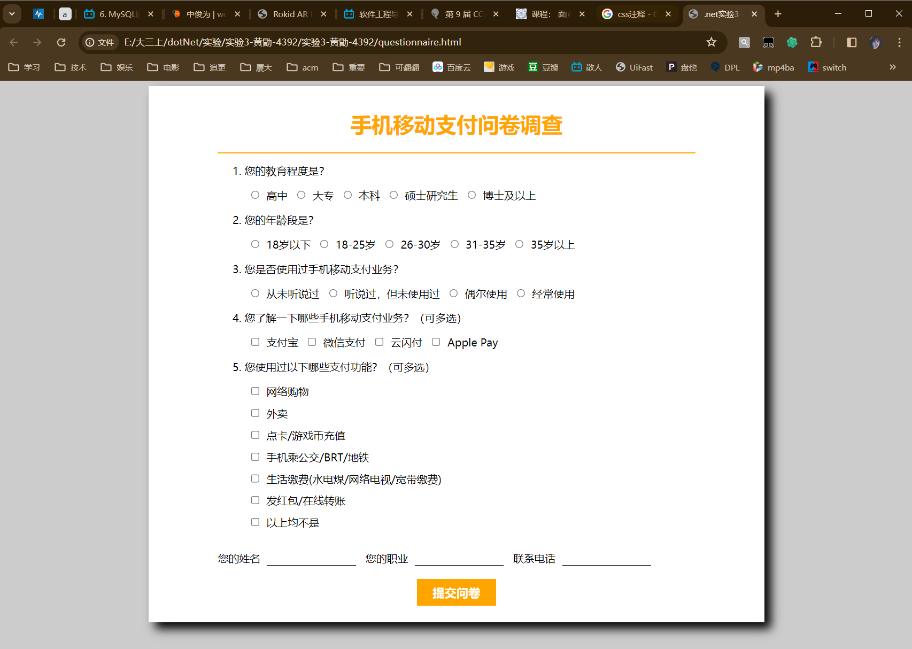
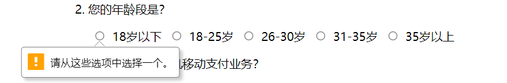
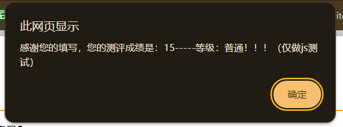
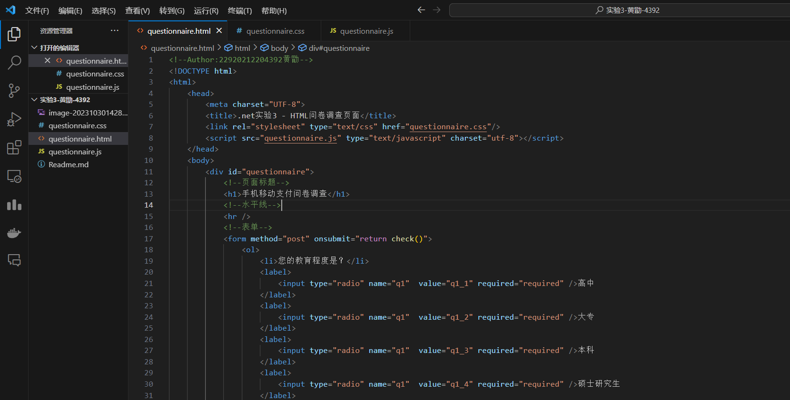
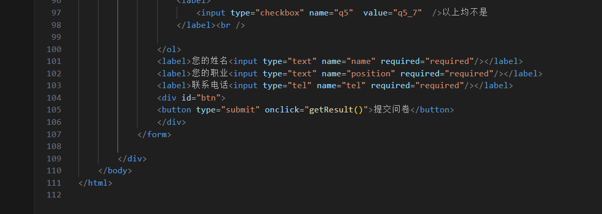
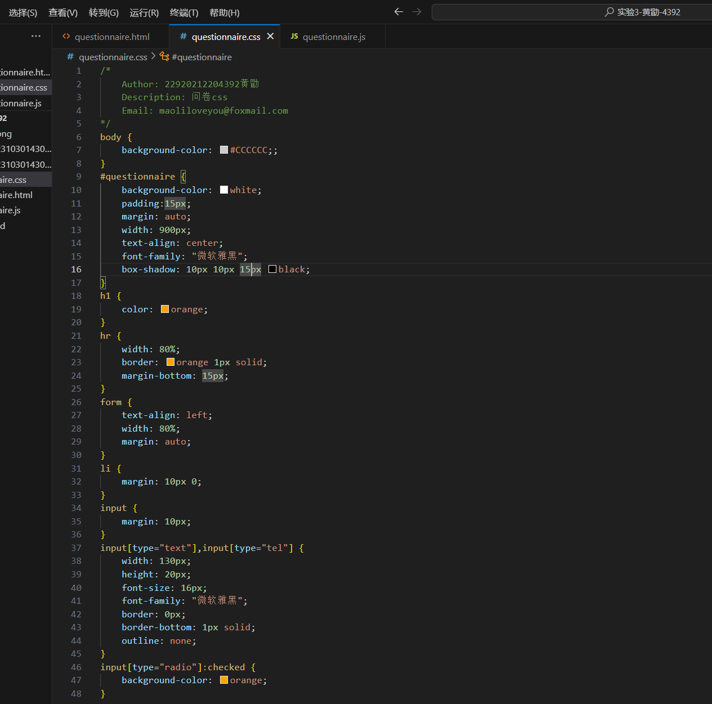
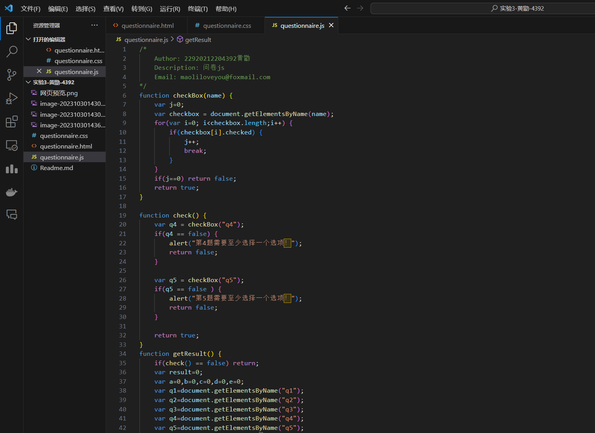

# .NET平台技术——实验三

​			    				22920212204392 黄勖 maoliloveyou@foxmail.com

## 网页预览

**出现未填写项：**

**点击提交：**

这是一个基于HTML、CSS和JavaScript的问卷调查页面的实验源码。

HTML（`questionnaire.html`）：

- HTML文件定义了整个网页的结构，包含了标题、样式表和JavaScript的引入以及问卷的具体内容。
- 问卷的内容包括多个问题，每个问题都有一个问题描述和相应的选择项，用户需要根据问题进行选择或填写。
- 用户需要填写姓名、职业、联系电话等个人信息。
- 一个提交按钮，用于提交问卷的答案。

CSS（`questionnaire.css`）：

- CSS文件定义了页面的外观和样式。
- 设置了页面的背景颜色、容器的背景颜色、内外边距、文本对齐方式等。
- 定制了标题的文字颜色和水平线的样式。
- 为输入元素（文本框、单选按钮、复选框）设置了样式，包括边框、背景色等。
- 设定了提交按钮的样式，包括大小、颜色、悬停效果等。

JavaScript（`questionnaire.js`）：

- JavaScript文件包含了用于处理问卷调查页面交互的脚本。
- 提供了 `checkBox` 函数，用于验证至少选择一个复选框。
- `check` 函数用于验证用户输入的完整性，确保第4和第5题至少选择一个选项，否则弹出警告。
- `getResult` 函数计算用户的测评成绩，根据问题的选择计算总分，然后显示一个消息框，显示测评结果等级。

总的来说，这个问卷调查页面允许用户填写个人信息和回答多个问题，包括单选和多选问题。通过JavaScript脚本，用户的答案将被验证并计算测评成绩，最终用户将获得一个测评等级的反馈。样式表则确保页面看起来漂亮，易于阅读和填写。这个页面可以用于手机移动支付相关的问卷调查，收集用户的反馈和意见。

## html

HTML源码创建了一个包含问卷调查的网页，用户可以填写问题，并在提交时触发JavaScript函数处理结果。问卷的样式由 "questionnaire.css" 控制，交互行为由 "questionnaire.js" 管理。

其中的内容和实现的过程：

1. `<!DOCTYPE html>`: 这是文档类型声明，指示文档采用HTML5标准。
2. `<html>`: 这是HTML文档的根元素，包含整个文档内容。
3. `<head>`: 包含关于文档的元信息，通常不会在页面上显示。
   - `<meta charset="UTF-8">`: 设置文档的字符编码为UTF-8，以确保正确处理各种字符。
   - `<title>.net实验3 - HTML问卷调查页面</title>`: 设置网页的标题，这个标题将显示在浏览器标签页上。
   - `<link rel="stylesheet" type="text/css" href="questionnaire.css"/>`: 引入一个名为 "questionnaire.css" 的CSS样式表，用于页面的样式设置。
   - ``: 引入一个名为 "questionnaire.js" 的JavaScript脚本文件，用于页面的交互功能。
4. `<body>`: 这是网页的主要内容部分，将在浏览器中可见。
   - `
`: 一个带有 "questionnaire" id 的 `
` 元素，用于包裹整个问卷调查。
     - `<h1>手机移动支付问卷调查</h1>`: 页面的标题，显示在页面顶部。
     - `
`: 一条水平线，用于分隔标题和问卷表单。
     - `<form method="post" onsubmit="return check()">`: 一个表单元素，它将用于用户填写问卷。
       - `<ol>`: 有序列表，用于包含问题及其选项。
         - 一系列关于教育程度、年龄段、使用手机移动支付业务、了解手机移动支付业务、以及使用支付功能的问题。每个问题都包括一组单选或多选输入字段（`<input>` 元素），每个输入字段都有一个相关联的标签（`<label>` 元素）。
       - `<label>您的姓名<input type="text" name="name" required="required"/></label>`: 一个用于用户输入姓名的文本框。
       - `<label>您的职业<input type="text" name="position" required="required"/></label>`: 一个用于用户输入职业的文本框。
       - `<label>联系电话<input type="tel" name="tel" required="required"/></label>`: 一个用于用户输入联系电话的文本框。
       - `
`: 一个带有 "btn" id 的 `
` 元素，用于包含提交按钮。
         - `<button type="submit" onclick="getResult()">提交问卷</button>`: 一个提交按钮，当用户点击它时，将触发 `getResult()` 函数，该函数在 "questionnaire.js" 文件中定义。

## css

用于设置网页的样式。

1. `body`: 这是对整个文档的样式设置。在这里：
   - `background-color: #CCCCCC;`: 设置整个页面的背景颜色为浅灰色。
2. `#questionnaire`: 这是具有 "questionnaire" id 的 `
` 元素的样式设置。在这里：
   - `background-color: white;`: 设置问卷部分的背景颜色为白色。
   - `padding: 15px;`: 添加内边距，使内容与容器边界有一定的距离。
   - `margin: auto;`: 设置水平居中。
   - `width: 900px;`: 设置容器的宽度为900像素。
   - `text-align: center;`: 设置文本内容居中对齐。
   - `font-family: "微软雅黑";`: 设置字体族为"微软雅黑"。
   - `box-shadow: 10px 10px 15px black;`: 添加一个黑色的阴影效果，使问卷容器看起来有立体感。
3. `h1`: 这是对 `<h1>` 标题元素的样式设置。在这里：
   - `color: orange;`: 设置标题文字的颜色为橙色。
4. `hr`: 这是对水平线元素的样式设置。在这里：
   - `width: 80%;`: 设置水平线的宽度为80%。
   - `border: orange 1px solid;`: 设置边框为1像素的橙色实线。
   - `margin-bottom: 15px;`: 设置底部外边距为15像素，用于分隔线与下面的内容。
5. `form`: 这是对表单元素的样式设置。在这里：
   - `text-align: left;`: 设置表单中的文本内容左对齐。
   - `width: 80%;`: 设置表单的宽度为80%。
   - `margin: auto;`: 设置表单水平居中。
6. `li`: 这是对列表项的样式设置。在这里：
   - `margin: 10px 0;`: 设置列表项的上下外边距为10像素，左右外边距为0，用于控制问题之间的间距。
7. `input`: 这是对所有输入元素的样式设置。在这里：
   - `margin: 10px;`: 设置输入元素的外边距为10像素，用于控制元素之间的间距。
8. `input[type="text"],input[type="tel"]`: 这是对文本输入框和电话号码输入框的样式设置。在这里：
   - `width: 130px;`: 设置输入框的宽度为130像素。
   - `height: 20px;`: 设置输入框的高度为20像素。
   - `font-size: 16px;`: 设置字体大小为16像素。
   - `border: 0px;`: 设置边框为0像素，去掉默认边框。
   - `border-bottom: 1px solid;`: 设置底部边框为1像素实线。
   - `outline: none;`: 去掉默认轮廓边框。
9. `input[type="radio"]:checked`: 这是对选中的单选按钮的样式设置。在这里：
   - `background-color: orange;`: 设置选中的单选按钮的背景颜色为橙色，用于强调选中状态。
10. `#btn`: 这是具有 "btn" id 的 `
` 元素的样式设置。在这里：
    - `text-align: center;`: 设置文本内容居中对齐。
11. `button`: 这是对按钮元素的样式设置。在这里：
    - `width: 120px;`: 设置按钮的宽度为120像素。
    - `height: 40px;`: 设置按钮的高度为40像素。
    - `background-color: orange;`: 设置按钮的背景颜色为橙色。
    - `border: 0px;`: 设置边框为0像素，去掉默认边框。
    - `color: white;`: 设置按钮文本的颜色为白色。
    - `font-size: 18px;`: 设置字体大小为18像素。
    - `font-family: "微软雅黑";`: 设置字体族为"微软雅黑"。
    - `font-weight: bold;`: 设置文本为粗体。
12. `button:hover`: 这是按钮在鼠标悬停时的样式设置。在这里：
    - `background-color: #FF6835;`: 设置背景颜色为悬停时的橙色，以提供视觉反馈。

## js

JavaScript文件，用于验证问卷的输入数据，并计算用户的测评成绩，最后显示一个消息框，提供反馈和测评等级。

1. `function checkBox(name)`: 一个名为 `checkBox` 的函数，它接受一个参数 `name`，用于检查是否至少选择了一个具有指定名称的复选框。函数的功能如下：
   - 定义一个变量 `j` 并初始化为0，它将用于跟踪选择的复选框数量。
   - 使用 `document.getElementsByName(name)` 获取所有具有指定名称的复选框元素。
   - 使用循环遍历这些复选框，如果有一个复选框被选中，则将 `j` 增加1，然后立即跳出循环。
   - 最后，如果 `j` 仍然为0，表示没有复选框被选中，函数返回 `false`，否则返回 `true`。
2. `function check()`: 一个名为 `check` 的函数，用于验证用户的输入是否符合要求。在这个函数中，首先调用了 `checkBox` 函数来检查第4和第5题是否至少选择了一个选项。如果有一个问题没有选择选项，将弹出警告消息，并返回 `false`。否则，返回 `true`。
3. `function getResult()`: 一个名为 `getResult` 的函数，用于计算问卷的结果并显示一个消息框。在这个函数中：
   - 首先，调用 `check` 函数来验证用户的输入。如果返回结果是 `false`，则不执行后续计算和显示结果的操作。
   - 然后，初始化了一些变量 `a`、`b`、`c`、`d` 和 `e` 用于存储每个问题的选择结果。根据问题的不同，这些变量会根据用户的选择被赋予不同的值。
   - 接下来，计算用户的总分数 `result`，根据问题的选择结果，将不同问题的得分相加。
   - 最后，根据计算出的总分 `result`，弹出一个消息框，显示问卷的测评成绩。根据不同的得分范围，显示不同的等级，以及一条提示消息。
