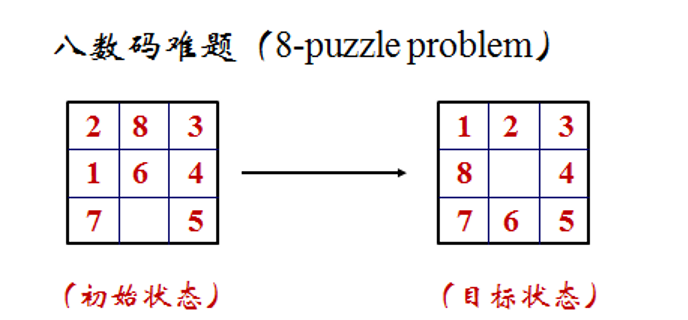
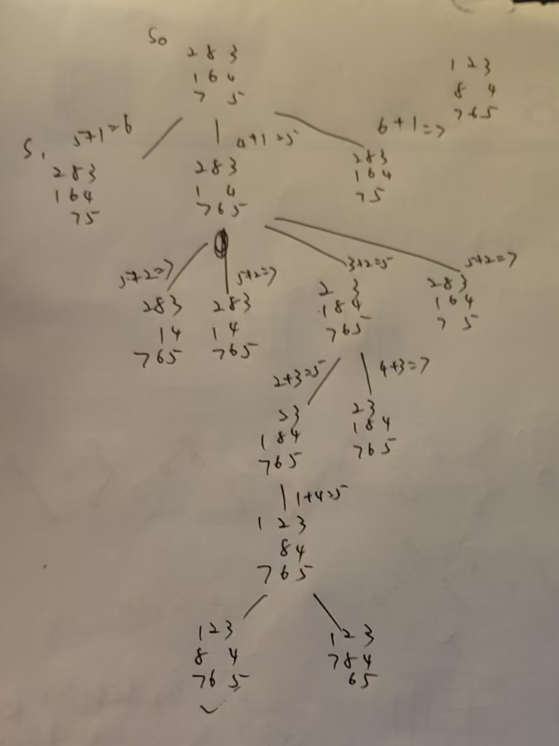

# 实验一：启发式搜索实验报告

## 1. 实验目的
1. 理解启发式搜索的基本原理，掌握A*算法的设计与实现。
2. 通过八数码问题验证启发式函数的有效性，分析其对搜索效率的影响。
3. 掌握如何设计合适的启发式函数（估价函数）以减少搜索空间，提升算法性能。

## 2. 问题描述
八数码问题是在3×3的棋盘上，分别放置了表有数字 1、2、3、4、5、6、7、8 的八张牌，初始状态 S0，目标状态 Sg，如下图所示。



可以使用的操作有空格左移，空格上移，空格右移，空格下移

即只允许把位于空格左、上、右、下方的牌移入空格。

## 3. 算法设计
### 3.1 A*算法原理  
A*算法是一种启发式搜索算法，结合了广度优先搜索（BFS）的完备性与启发式函数的效率。其核心公式为：

$$
f(n) = g(n) + h(n) 
$$
- g(n)：从初始节点到当前节点的实际代价（路径长度）。  
- h(n)：从当前节点到目标节点的启发式估计代价（启发函数）。  

A*算法步骤：  
1. 使用优先队列（堆）按 f(n) 从小到大扩展节点。  
2. 维护已访问节点的记录，避免重复搜索。  
3. 扩展节点时生成所有合法子节点，并计算其 f(n)。  
4. 当目标节点被扩展时，回溯路径得到最优解。

### 3.2 启发函数设计  
在这里，我们选择曼哈顿距离总和作为启发函数 h(n)，其计算方式为：
\[
h(n) = \sum_{i=1}^8 |i - i^*|
\]
其中，$i^*$ 为目标状态中数字i的位置，$i$ 为当前状态中数字i的位置。

曼哈顿距离定义为：
$$
d = |x_1 - x_2| + |y_1 - y_2|  
$$
其中，$(x_1,y_1)$为当前数字的位置，$(x_2,y_2)$为目标位置。  

曼哈顿距离作为启发式算法，可以满足A\*算法的可采纳性条件（$h(n) <= h^*(n)$），保证找到最优解；同时计算简单，能有效引导搜索向目标状态靠近。

### 3.3 节点状态图绘制



## 4. 实验结果

运行代码后，输出结果为：
```py
Step 0:
2 8 3
1 6 4
7 0 5
----------
Step 1:
2 8 3
1 0 4
7 6 5
----------
Step 2:
2 0 3
1 8 4
7 6 5
----------
Step 3:
0 2 3
1 8 4
7 6 5
----------
Step 4:
1 2 3
0 8 4
7 6 5
----------
Step 5:
1 2 3
8 0 4
7 6 5
----------
```
## 5. 结论  
- A*算法结合曼哈顿距离启发函数，成功找到从初始状态到目标状态的最短路径（6步）。  
- A*算法优势保证找到最优解，而且与我们熟悉的DFS和BFS相比，启发函数减少了搜索空间，避免盲目遍历。  

## 6. 代码实现
```py
import heapq

def heuristic(state):
    """计算曼哈顿距离总和作为启发式函数"""
    target = (1, 2, 3, 8, 0, 4, 7, 6, 5)
    h = 0
    for i in range(9):
        if state[i] == 0:
            continue
        val = state[i]
        target_pos = target.index(val)
        x1, y1 = divmod(i, 3)
        x2, y2 = divmod(target_pos, 3)
        h += abs(x1 - x2) + abs(y1 - y2)
    return h

def get_moves(state):
    """生成所有可能的移动后的状态"""
    state_list = list(state)
    idx = state_list.index(0)
    x, y = divmod(idx, 3)
    moves = []
    # 四个方向：上、下、左、右（对应坐标变化）
    directions = [(-1, 0), (1, 0), (0, -1), (0, 1)]
    for dx, dy in directions:
        new_x = x + dx
        new_y = y + dy
        if 0 <= new_x < 3 and 0 <= new_y < 3:
            new_idx = new_x * 3 + new_y
            new_state = state_list.copy()
            new_state[idx], new_state[new_idx] = new_state[new_idx], new_state[idx]
            moves.append(tuple(new_state))
    return moves

def a_star(initial_state):
    """A*算法实现"""
    target = (1, 2, 3, 8, 0, 4, 7, 6, 5)
    heap = []
    # 优先队列存储 (f(n), state)
    heapq.heappush(heap, (heuristic(initial_state), initial_state))
    visited = {initial_state: None}  # 记录父节点路径

    while heap:
        current_f, current_state = heapq.heappop(heap)
        if current_state == target:
            # 回溯路径
            path = []
            node = current_state
            while node is not None:
                path.append(node)
                node = visited[node]
            return path[::-1]  # 反转路径，从初始到目标
        for move in get_moves(current_state):
            if move not in visited:
                visited[move] = current_state
                new_f = heuristic(move)
                heapq.heappush(heap, (new_f, move))
    return None

def print_path(path):
    """打印路径中的每一步状态"""
    for step, state in enumerate(path):
        print(f"Step {step}:")
        for i in range(0, 9, 3):
            print(state[i], state[i+1], state[i+2])
        print("----------")

# 初始状态示例（用户提供的S0）
initial = (2, 8, 3, 1, 6, 4, 7, 0, 5)
path = a_star(initial)
if path:
    print("共%d步：" % len(path))
    print_path(path)
else:
    print("未找到解！")
```