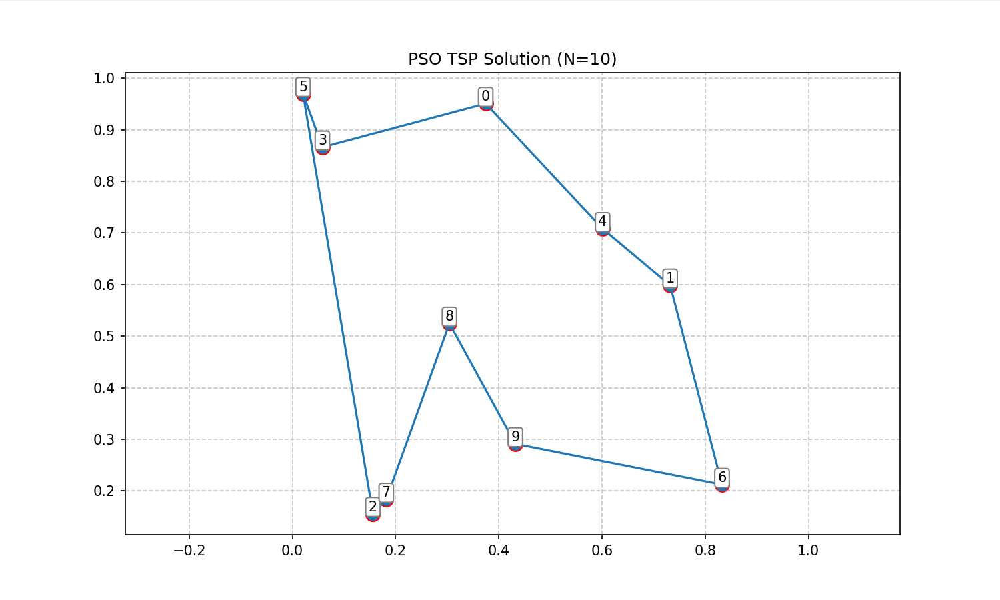
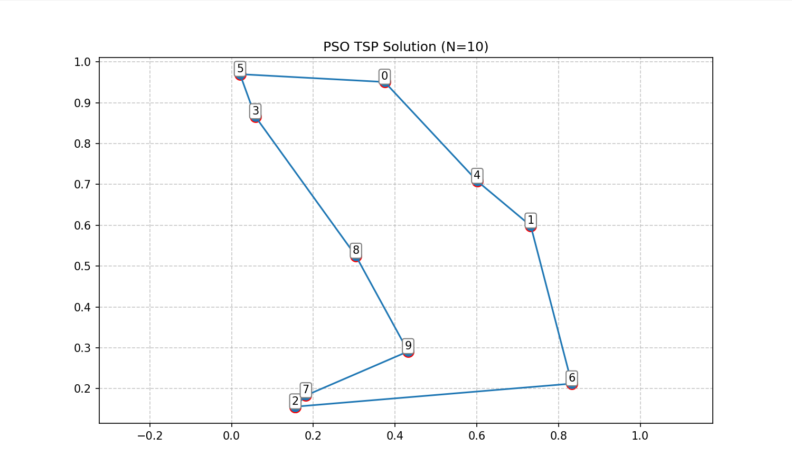
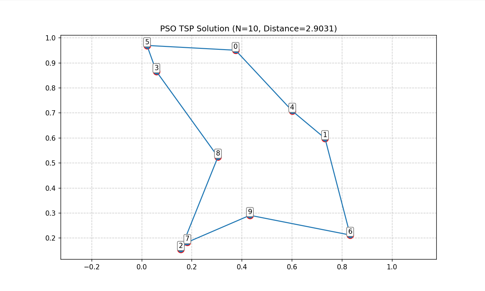
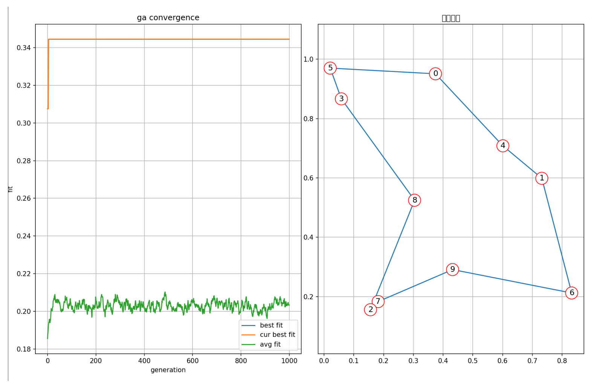

# 实验三：粒子群算法解决旅行商问题实验报告

## 1. 实验目的
- 理解粒子群算法的基本原理与实现步骤
- 掌握粒子群算法在组合优化问题（TSP）中的应用

## 2. 问题描述
给定n个城市坐标，寻找一条最短的遍历所有城市且仅访问每个城市一次的闭合路径

在这里我们选择n为10，并通过固定的随机数种子来随机生成城市坐标(便于复现结果)，城市间距离采用欧氏距离计算

## 3. 算法设计
- **排列编码**：用整数序列表示城市访问顺序，如 `[2,5,1,8,...]`

- **适应度计算**：路径总长度，公式为：fitness = total_distance（越小越好）

- **粒子定义**：
  - 位置：表示一个可行的TSP路径
  - 速度：一系列交换操作，用于更新粒子位置
  - 个体最优位置(pbest)：粒子历史最优路径
  - 全局最优位置(gbest)：所有粒子中的最优路径

- **速度与位置更新机制**：

    | 组件 | 实现方式 |
    |---------|----------|
    | 速度更新 | 结合历史速度、个体认知项和社会认知项，以及随机扰动 |
    | 位置更新 | 根据速度中的交换操作序列更新当前位置 |
    | 惯性权重 | 非线性衰减策略，从0.9到0.4 |
## 4. 实验参数
| 参数 | 值 |
|---------|----------|
| 粒子数量 | 150 |
| 最大迭代次数 | 200 |
| 认知参数(c1) | 1.49618 |
| 社会参数(c2) | 1.49618 |
| 惯性权重范围 | 0.9-0.4 |
| 局部搜索概率 | 0.1 |

> 关于认知参数和社会参数的取值参考了文献[Particle swarm optimization: Velocity initialization](https://ieeexplore.ieee.org/document/6256112)中的建议

## 5. 实验结果
### 5.1 基础PSO算法

基础PSO算法在TSP问题上存在以下问题：
1. 容易陷入局部最优
2. 收敛速度慢
3. 解的质量不稳定





这主要是因为基础PSO算法设计用于连续优化问题，而TSP是离散组合优化问题，需要特殊处理。

### 5.2 改进PSO算法

针对基础PSO的问题，我们实现了以下改进：

1. **2-opt局部搜索**：定期对粒子和全局最优解应用局部搜索，提高解的质量
2. **重启策略**：当算法连续多次迭代无改进时，重新初始化部分粒子，跳出局部最优
3. **非线性惯性权重衰减**：使用二次函数衰减惯性权重，平衡全局与局部搜索
4. **随机扰动**：在速度更新中加入随机交换操作，增加种群多样性

改进后的算法运行结果显著优于基础版本：



与实验二的遗传算法结果对比，可以看到解是一致的，证明了改进后PSO算法的有效性



### 5.3 改进效果分析

1. **收敛速度提升**：改进版PSO通常在前50次迭代内就能找到较好的解
2. **跳出局部最优能力增强**：重启策略和随机扰动使算法能够探索更广阔的解空间
3. **解的质量提高**：局部搜索策略显著提高了最终解的质量
4. **稳定性增强**：多次运行的结果更加稳定，方差减小

## 6. 结论
- 改进的PSO算法能有效求解TSP问题
- 局部搜索策略对提高解的质量至关重要
- 重启策略和随机扰动有效防止早熟收敛
- PSO算法在处理离散优化问题时需要特殊的适应性设计

## 7. 代码实现
```python
import numpy as np
import random
import matplotlib.pyplot as plt

def generate_cities(n_cities, seed=42):
    np.random.seed(seed)
    return {i: (np.random.rand(), np.random.rand()) for i in range(n_cities)}

def calculate_distance_matrix(coords):
    cities = list(coords.keys())
    n = len(cities)
    matrix = np.zeros((n, n))
    for i in range(n):
        for j in range(n):
            x1, y1 = coords[i]
            x2, y2 = coords[j]
            matrix[i][j] = np.sqrt((x1-x2)**2 + (y1-y2)**2)
    return matrix

# 计算路径总距离
def calculate_path_distance(path, distance_matrix):
    """计算路径总距离，包括回到起点"""
    total = 0
    for i in range(len(path)-1):
        total += distance_matrix[path[i]][path[i+1]]
    # 添加回到起点的距离
    total += distance_matrix[path[-1]][path[0]]
    return total

# 2-opt局部搜索算法
def local_search(route, distance_matrix, max_iterations=20):
    """使用2-opt算法进行局部搜索优化"""
    best_route = route.copy()
    improved = True
    n = len(route)
    
    while improved and max_iterations > 0:
        improved = False
        max_iterations -= 1
        for i in range(1, n-1):
            for j in range(i+1, n):
                if j-i == 1: continue  # 相邻城市不交换
                new_route = best_route.copy()
                # 2-opt交换：翻转i到j之间的路径
                new_route[i:j] = new_route[i:j][::-1]
                
                # 计算新路径长度
                old_distance = calculate_path_distance(best_route, distance_matrix)
                new_distance = calculate_path_distance(new_route, distance_matrix)
                
                if new_distance < old_distance:
                    best_route = new_route
                    improved = True
                    break
            if improved:
                break
                    
    return best_route

def plot_route(best_tour, coords, title="Best Route"):
    plt.figure(figsize=(10, 6))
    x = [coords[city][0] for city in best_tour]
    y = [coords[city][1] for city in best_tour]
    
    x += [x[0]]
    y += [y[0]]
    
    plt.plot(x, y, 'o-', markersize=8, linewidth=1.5)
    plt.scatter(x, y, c='red', s=100)
    
    for i, city in enumerate(best_tour):
        plt.annotate(f"{city}", (coords[city][0], coords[city][1]),
                     fontsize=10, ha='center', va='bottom',
                     bbox=dict(boxstyle='round,pad=0.2', fc='white', ec='gray'))
    
    plt.title(title)
    plt.grid(True, linestyle='--', alpha=0.7)
    plt.axis('equal')
    plt.show()

class Particle:
    def __init__(self, cities):
        self.position = random.sample(cities, len(cities))
        self.velocity = []
        self.pbest = self.position.copy()
        self.fitness = self.calculate_fitness()
        self.best_fitness = self.fitness
    
    def calculate_fitness(self):
        total = 0
        for i in range(len(self.position)-1):
            total += distance_matrix[self.position[i]][self.position[i+1]]
        # 添加回到起点的距离
        total += distance_matrix[self.position[-1]][self.position[0]]
        return total
    
    def update_velocity(self, gbest, c1, c2, omega):
        new_velocity = []
        # 保留部分历史速度，使用omega参数控制
        new_velocity += [swap for swap in self.velocity if random.random() < omega]
        
        # 个体认知项
        if random.random() < c1:
            for i in range(len(self.position)):
                if self.position[i] != self.pbest[i] and random.random() < 0.3:
                    j = self.pbest.index(self.position[i])
                    new_velocity.append((i, j))
        
        # 社会认知项
        if random.random() < c2:
            for i in range(len(self.position)):
                if self.position[i] != gbest[i] and random.random() < 0.3:
                    j = gbest.index(self.position[i])
                    new_velocity.append((i, j))
        
        if random.random() < 0.1:  # 小概率添加随机交换
            i, j = random.sample(range(len(self.position)), 2)
            new_velocity.append((i, j))
            
        self.velocity = new_velocity
    
    def update_position(self):
        new_pos = self.position.copy()
        for i, j in self.velocity:
            new_pos[i], new_pos[j] = new_pos[j], new_pos[i]
        self.position = new_pos
        
    def apply_local_search(self, probability=0.1):
        if random.random() < probability:
            self.position = local_search(self.position, distance_matrix)

def pso_tsp(max_iter, num_particles, c1=2, c2=2, omega_start=0.9, omega_end=0.4, local_search_prob=0.1):
    global distance_matrix
    cities = list(range(len(distance_matrix)))
    particles = [Particle(cities) for _ in range(num_particles)]
    
    # 初始化全局最优
    gbest_particle = min(particles, key=lambda p: p.fitness)
    gbest = gbest_particle.position.copy()
    best_fitness = gbest_particle.fitness
    
    convergence = [best_fitness]
    no_improvement_count = 0
    last_best_fitness = best_fitness
    
    for iteration in range(max_iter):
        # 非线性惯性权重衰减
        omega = omega_start - (omega_start - omega_end) * (iteration / max_iter) ** 2
        
        for particle in particles:
            # 更新速度和位置
            particle.update_velocity(gbest, c1, c2, omega)
            particle.update_position()
            
            # 应用局部搜索
            particle.apply_local_search(local_search_prob)
            
            # 更新适应度
            current_fitness = particle.calculate_fitness()
            if current_fitness < particle.best_fitness:
                particle.pbest = particle.position.copy()
                particle.best_fitness = current_fitness
                
                if current_fitness < best_fitness:
                    best_fitness = current_fitness
                    gbest = particle.position.copy()
        
        # 记录收敛信息
        convergence.append(best_fitness)
        
        # 检查是否有改进
        if abs(best_fitness - last_best_fitness) < 1e-6:
            no_improvement_count += 1
        else:
            no_improvement_count = 0
        
        last_best_fitness = best_fitness
        
        # 如果连续多次没有改进，重新初始化部分粒子
        if no_improvement_count > 20:
            print(f"Iteration {iteration+1}: Restarting some particles...")
            for i in range(num_particles // 3):  # 重新初始化1/3的粒子
                particles[i] = Particle(cities)
            no_improvement_count = 0
        
        # 每隔一定迭代次数对全局最优解应用局部搜索
        if iteration % 10 == 0:
            gbest = local_search(gbest, distance_matrix)
            new_fitness = calculate_path_distance(gbest, distance_matrix)
            if new_fitness < best_fitness:
                best_fitness = new_fitness
                print(f"Iteration {iteration+1}: Improved by local search: {best_fitness:.2f}")
        
        print(f"Iteration {iteration+1}/{max_iter}, Best Fitness: {best_fitness:.4f}")
    
    # 最终对全局最优解应用一次局部搜索
    gbest = local_search(gbest, distance_matrix, max_iterations=50)
    final_fitness = calculate_path_distance(gbest, distance_matrix)
    if final_fitness < best_fitness:
        best_fitness = final_fitness
        print(f"Final optimization: {best_fitness:.4f}")
    
    # 绘制收敛曲线
    plt.figure(figsize=(10, 6))
    plt.plot(range(len(convergence)), convergence, 'b-', linewidth=2)
    plt.title('PSO Convergence Curve')
    plt.xlabel('Iteration')
    plt.ylabel('Best Fitness')
    plt.grid(True)
    plt.show()
    
    return gbest, best_fitness

# 主程序
if __name__ == "__main__":
    # 生成城市数据
    n_cities = 10 
    coords = generate_cities(n_cities)
    distance_matrix = calculate_distance_matrix(coords)
    
    # PSO参数设置
    max_iter = 200
    num_particles = 150  # 增加粒子数量
    
    # 运行PSO
    best_path, best_distance = pso_tsp(
        max_iter=max_iter,
        num_particles=num_particles,
        c1=1.5,
        c2=1.5,
        omega_start=0.9,
        omega_end=0.4,
        local_search_prob=0.1
    )
    
    print(f"最终路径长度: {best_distance:.4f}")
    
    # 可视化结果
    plot_route(best_path, coords, title=f"PSO TSP Solution (N={n_cities}, Distance={best_distance:.4f})")
```