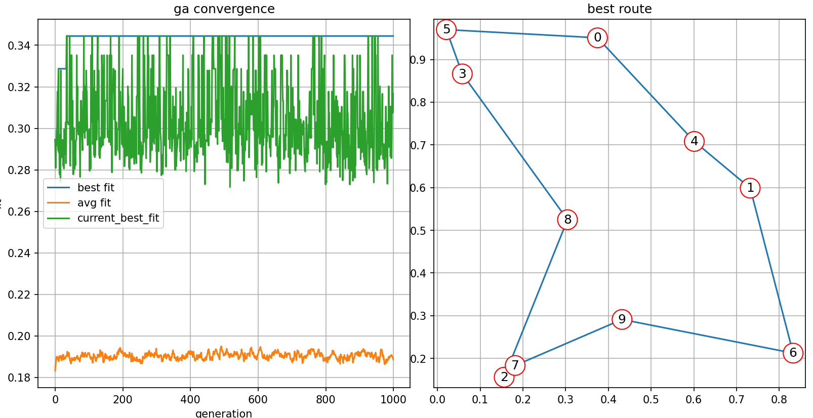
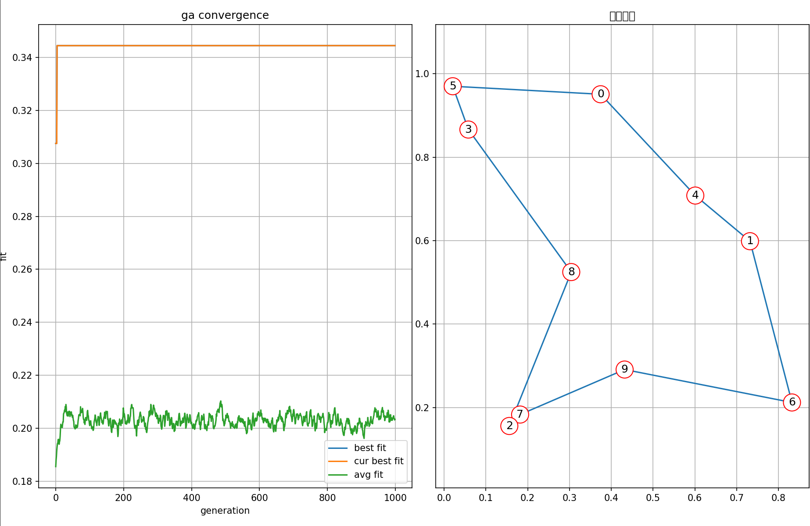

# 实验二：遗传算法解决旅行商问题实验报告

## 1. 实验目的
- 理解遗传算法的基本原理与实现步骤
- 掌握遗传算法在组合优化问题（TSP）中的应用

## 2. 问题描述
给定n个城市坐标，寻找一条最短的遍历所有城市且仅访问每个城市一次的闭合路径

在这里我们选择n为10，并通过固定的随机数种子来随机生成城市坐标(便于复现结果)，城市间距离采用欧氏距离计算

## 3. 算法设计
- **排列编码**：用整数序列表示城市访问顺序，如 `[2,5,1,8,...]`

- **适应度计算**：路径总距离的倒数，公式为：fitness = 1 / total_distance
-  **各个遗传算子**
  
    | 算子类型 | 具体实现 |
    |---------|----------|
    | 选择算子 | 轮盘赌选择（基于适应度比例） |
    | 交叉算子 | 顺序交叉（OX），保留父代片段并按顺序填充 |
    | 变异算子 | 交换变异（随机交换两个城市位置） |

## 4. 实验参数
| 参数 | 值 |
|---------|----------|
| 种群大小 | 1000 |
| 交叉概率 | 0.9 |
| 变异概率 | 0.02|
| 迭代次数 | 1000 |


## 5. 实验结果
### 5.1 遗传算法可视化



运行结果为
```txt
第 0 代，最佳适应度: 0.294472，平均适应度: 0.183237
第 100 代，最佳适应度: 0.298631，平均适应度: 0.191455
第 200 代，最佳适应度: 0.328691，平均适应度: 0.191989
第 300 代，最佳适应度: 0.288936，平均适应度: 0.191627
第 400 代，最佳适应度: 0.299023，平均适应度: 0.192817
第 500 代，最佳适应度: 0.289836，平均适应度: 0.191325
第 600 代，最佳适应度: 0.297620，平均适应度: 0.191376
第 700 代，最佳适应度: 0.306543，平均适应度: 0.187914
第 800 代，最佳适应度: 0.278351，平均适应度: 0.188071
第 900 代，最佳适应度: 0.302935，平均适应度: 0.192053

最佳路径: [5, 3, 8, 2, 7, 9, 6, 1, 4, 0]
最佳适应度值: 0.344463
总距离: 2.903068
```

### 5.2 精英策略改进版对比
我们可以看到基础的遗传算法虽然一定程度上已经收敛(历史最佳值)，但每次迭代时的最佳值却波动仍然变化明显

造成这种情况的原因是优秀个体因为较高的交叉率，使得优良基因被破坏

我们可以采取自适应的变异率，但是在查阅资料后，我认为更有效的方法是精英策略

精英策略会使得每代最优的个体直接进入下一次迭代，这样也就避免了最优个体被破坏

算法运行结果如下



解的结果为
```txt
第 0 代，最佳适应度: 0.307513，平均适应度: 0.185483
第 100 代，最佳适应度: 0.344463，平均适应度: 0.200978
第 200 代，最佳适应度: 0.344463，平均适应度: 0.206567
第 300 代，最佳适应度: 0.344463，平均适应度: 0.204892
第 400 代，最佳适应度: 0.344463，平均适应度: 0.202244
第 500 代，最佳适应度: 0.344463，平均适应度: 0.202959
第 600 代，最佳适应度: 0.344463，平均适应度: 0.205697
第 700 代，最佳适应度: 0.344463，平均适应度: 0.206750
第 800 代，最佳适应度: 0.344463，平均适应度: 0.202047
第 900 代，最佳适应度: 0.344463，平均适应度: 0.200709

最佳路径: [6, 9, 7, 2, 8, 3, 5, 0, 4, 1]
最佳适应度值: 0.344463
总距离: 2.903068
```

### 改进效果分析
1. **总体平均适应度提升**：精英个体直接进入下一代可以一定程度上引导其他个体向精英方向进化
2. **收敛速度加快**：精英个体直接进入下一代，减少了无效搜索时间，从上面的可视化可以看出。基础遗传算法在20-30代间找到了最优解，而精英策略版遗传算法在5代之内就能找到最优解


## 6. 结论
- 遗传算法能有效求解TSP问题
- 精英策略通过保留优质个体显著提升了算法性能

## 代码实现
```py
# 基础版
import numpy as np
import random
import matplotlib.pyplot as plt

# 参数设置
POPULATION_SIZE =1000  
GENERATIONS = 1000  
MUTATION_RATE = 0.02  
CROSSOVER_RATE = 0.9  
CITIES = 10  
np.random.seed(42) 
COORDS = np.random.rand(CITIES, 2)  

class Individual:
    def __init__(self, tour=None):
        if tour is None:
            self.tour = random.sample(range(CITIES), CITIES)
        else:
            self.tour = tour
        self.fitness = None

    def calculate_fitness(self):
        total_distance = 0
        for i in range(len(self.tour)):
            city_a = COORDS[self.tour[i]]
            city_b = COORDS[self.tour[(i+1) % len(self.tour)]]
            total_distance += np.linalg.norm(city_a - city_b)
        self.fitness = 1 / total_distance  # 适应度为距离倒数
        return self.fitness

def initialize_population():
    return [Individual() for _ in range(POPULATION_SIZE)]

def selection(population):
    # 轮盘赌选择
    fitness_sum = sum(ind.fitness for ind in population)
    probabilities = [ind.fitness / fitness_sum for ind in population]
    selected = random.choices(population, weights=probabilities, k=POPULATION_SIZE)
    return selected

def ordered_crossover(parent1, parent2):
    if random.random() > CROSSOVER_RATE:
        return parent1.tour, parent2.tour
    size = len(parent1.tour)
    child1 = [-1] * size
    child2 = [-1] * size
    start, end = sorted(random.sample(range(size), 2))
    # 保留父代片段
    child1[start:end] = parent1.tour[start:end]
    child2[start:end] = parent2.tour[start:end]
    # 填充剩余基因
    ptr = end
    for i in range(size):
        current_gene = parent2.tour[(end + i) % size]
        if current_gene not in child1:
            child1[ptr % size] = current_gene
            ptr += 1
    ptr = end
    for i in range(size):
        current_gene = parent1.tour[(end + i) % size]
        if current_gene not in child2:
            child2[ptr % size] = current_gene
            ptr += 1
    return child1, child2

def mutate(tour):
    if random.random() < MUTATION_RATE:
        idx1, idx2 = random.sample(range(len(tour)), 2)
        tour[idx1], tour[idx2] = tour[idx2], tour[idx1]
    return tour

def plot_route(best_tour, coords, title="best route"):
    """绘制城市坐标和路径"""
    plt.figure(figsize=(10, 6))
    x = [coords[city][0] for city in best_tour]
    y = [coords[city][1] for city in best_tour]
    
    # 添加起点回到终点的连线
    x.append(x[0])
    y.append(y[0])
    
    # 绘制路径
    plt.plot(x, y, 'o-', markersize=10)
    
    # 标记城市编号
    for i, city in enumerate(best_tour):
        plt.annotate(f"{city}", (coords[city][0], coords[city][1]), 
                    fontsize=12, ha='center', va='center',
                    bbox=dict(boxstyle='circle', fc='white', ec='red'))
    
    plt.title(title)
    plt.grid(True)
    plt.axis('equal')
    return plt.gcf()

def genetic_algorithm():
    population = initialize_population()
    best_fitness_history = []
    avg_fitness_history = []
    cur_best_fit_hist = []
    best_individual_ever = None
    best_fitness_ever = 0
    
    # 初始计算适应度
    for ind in population:
        ind.calculate_fitness()
        if ind.fitness > best_fitness_ever:
            best_fitness_ever = ind.fitness
            best_individual_ever = Individual(ind.tour.copy())
    
    for generation in range(GENERATIONS):
        # 选择
        selected = selection(population)
        
        # 交叉
        next_generation = []
        for i in range(0, POPULATION_SIZE, 2):
            if i+1 < len(selected):
                parent1 = selected[i]
                parent2 = selected[i+1]
                child1, child2 = ordered_crossover(parent1, parent2)
                next_generation.append(Individual(child1))
                next_generation.append(Individual(child2))
        
        # 变异
        for ind in next_generation:
            ind.tour = mutate(ind.tour)
            
        # 计算新一代个体的适应度
        for ind in next_generation:
            ind.calculate_fitness()
            
        population = next_generation
        
        # 找出当前代最佳个体
        current_best = max(population, key=lambda x: x.fitness)
        
        # 更新历史最佳个体
        if current_best.fitness > best_fitness_ever:
            best_fitness_ever = current_best.fitness
            best_individual_ever = Individual(current_best.tour.copy())
            best_individual_ever.fitness = current_best.fitness
        
        # 记录最佳适应度和平均适应度
        best_fitness_history.append(best_fitness_ever)
        avg_fitness = sum(ind.fitness for ind in population) / len(population)
        cur_best_fit_hist.append(current_best.fitness)
        avg_fitness_history.append(avg_fitness)
        
        # 每10代打印一次进度
        if generation % 100 == 0:
            print(f"第 {generation} 代，最佳适应度: {current_best.fitness:.6f}，平均适应度: {avg_fitness:.6f}")
    
    # 打印最终结果
    print("\n遗传算法执行完成！")
    print(f"最佳路径: {best_individual_ever.tour}")
    print(f"最佳适应度值: {best_individual_ever.fitness:.6f}")
    print(f"总距离: {1 / best_individual_ever.fitness:.6f}")
    
    # 创建一个包含两个子图的图形
    fig = plt.figure(figsize=(16, 8))
    
    # 第一个子图：收敛曲线
    ax1 = fig.add_subplot(121)
    ax1.plot(best_fitness_history, label='best fit')
    ax1.plot(avg_fitness_history, label='avg fit')
    ax1.plot(cur_best_fit_hist, label='current_best_fit')
    ax1.set_xlabel('generation')
    ax1.set_ylabel('fit')
    ax1.set_title('ga convergence')
    ax1.legend()
    ax1.grid(True)
    
    # 第二个子图：最佳路径
    ax2 = fig.add_subplot(122)
    x = [COORDS[city][0] for city in best_individual_ever.tour]
    y = [COORDS[city][1] for city in best_individual_ever.tour]
    
    # 添加起点回到终点的连线
    x.append(x[0])
    y.append(y[0])
    
    # 绘制路径
    ax2.plot(x, y, 'o-', markersize=10)
    
    # 标记城市编号
    for i, city in enumerate(best_individual_ever.tour):
        ax2.annotate(f"{city}", (COORDS[city][0], COORDS[city][1]), 
                    fontsize=12, ha='center', va='center',
                    bbox=dict(boxstyle='circle', fc='white', ec='red'))
    
    ax2.set_title('best route')
    ax2.grid(True)
    ax2.axis('equal')
    
    plt.tight_layout()
    plt.savefig('ga_results.png')  # 保存图像到文件
    plt.show()
    
    return best_individual_ever

# 运行算法
best_solution = genetic_algorithm()
```
```py
# 有精英策略
import numpy as np
import random
import matplotlib.pyplot as plt

# 参数设置
POPULATION_SIZE =1000 
GENERATIONS = 1000 
MUTATION_RATE = 0.02  
CROSSOVER_RATE = 0.9  
CITIES = 10  
np.random.seed(42) 
COORDS = np.random.rand(CITIES, 2)  

class Individual:
    def __init__(self, tour=None):
        if tour is None:
            self.tour = random.sample(range(CITIES), CITIES)
        else:
            self.tour = tour
        self.fitness = None

    def calculate_fitness(self):
        total_distance = 0
        for i in range(len(self.tour)):
            city_a = COORDS[self.tour[i]]
            city_b = COORDS[self.tour[(i+1) % len(self.tour)]]
            total_distance += np.linalg.norm(city_a - city_b)
        self.fitness = 1 / total_distance  # 适应度为距离倒数
        return self.fitness

def initialize_population():
    return [Individual() for _ in range(POPULATION_SIZE)]

def selection(population):
    # 轮盘赌选择
    fitness_sum = sum(ind.fitness for ind in population)
    probabilities = [ind.fitness / fitness_sum for ind in population]
    selected = random.choices(population, weights=probabilities, k=POPULATION_SIZE)
    return selected

def ordered_crossover(parent1, parent2):
    if random.random() > CROSSOVER_RATE:
        return parent1.tour, parent2.tour
    size = len(parent1.tour)
    child1 = [-1] * size
    child2 = [-1] * size
    start, end = sorted(random.sample(range(size), 2))
    # 保留父代片段
    child1[start:end] = parent1.tour[start:end]
    child2[start:end] = parent2.tour[start:end]
    # 填充剩余基因
    ptr = end
    for i in range(size):
        current_gene = parent2.tour[(end + i) % size]
        if current_gene not in child1:
            child1[ptr % size] = current_gene
            ptr += 1
    ptr = end
    for i in range(size):
        current_gene = parent1.tour[(end + i) % size]
        if current_gene not in child2:
            child2[ptr % size] = current_gene
            ptr += 1
    return child1, child2

def mutate(tour):
    if random.random() < MUTATION_RATE:
        idx1, idx2 = random.sample(range(len(tour)), 2)
        tour[idx1], tour[idx2] = tour[idx2], tour[idx1]
    return tour

def plot_route(best_tour, coords, title="best route"):
    """绘制城市坐标和路径"""
    plt.figure(figsize=(10, 6))
    x = [coords[city][0] for city in best_tour]
    y = [coords[city][1] for city in best_tour]
    
    # 添加起点回到终点的连线
    x.append(x[0])
    y.append(y[0])
    
    # 绘制路径
    plt.plot(x, y, 'o-', markersize=10)
    
    # 标记城市编号
    for i, city in enumerate(best_tour):
        plt.annotate(f"{city}", (coords[city][0], coords[city][1]), 
                    fontsize=12, ha='center', va='center',
                    bbox=dict(boxstyle='circle', fc='white', ec='red'))
    
    plt.title(title)
    plt.grid(True)
    plt.axis('equal')
    return plt.gcf()

def genetic_algorithm():
    population = initialize_population()
    best_fitness_history = []
    avg_fitness_history = []
    cur_best_fit_hist = []
    best_individual_ever = None
    best_fitness_ever = 0
    
    # 初始计算适应度
    for ind in population:
        ind.calculate_fitness()
        if ind.fitness > best_fitness_ever:
            best_fitness_ever = ind.fitness
            best_individual_ever = Individual(ind.tour.copy())
    
    for generation in range(GENERATIONS):
        # 选择
        selected = selection(population)
        
        # 交叉
        next_generation = []
        for i in range(0, POPULATION_SIZE, 2):
            if i+1 < len(selected):
                parent1 = selected[i]
                parent2 = selected[i+1]
                child1, child2 = ordered_crossover(parent1, parent2)
                next_generation.append(Individual(child1))
                next_generation.append(Individual(child2))
        
        # 变异
        for ind in next_generation:
            ind.tour = mutate(ind.tour)
            
        # 计算新一代个体的适应度
        for ind in next_generation:
            ind.calculate_fitness()
            
        population = next_generation
        
        # 找出当前代最佳个体
        current_best = max(population, key=lambda x: x.fitness)
        
        # 更新历史最佳个体
        if current_best.fitness > best_fitness_ever:
            best_fitness_ever = current_best.fitness
            best_individual_ever = Individual(current_best.tour.copy())
            best_individual_ever.fitness = current_best.fitness
        
        # 记录最佳适应度和平均适应度
        best_fitness_history.append(best_fitness_ever)
        avg_fitness = sum(ind.fitness for ind in population) / len(population)
        cur_best_fit_hist.append(current_best.fitness)
        avg_fitness_history.append(avg_fitness)
        
        # 每10代打印一次进度
        if generation % 100 == 0:
            print(f"第 {generation} 代，最佳适应度: {current_best.fitness:.6f}，平均适应度: {avg_fitness:.6f}")
    
    # 打印最终结果
    print("\n遗传算法执行完成！")
    print(f"最佳路径: {best_individual_ever.tour}")
    print(f"最佳适应度值: {best_individual_ever.fitness:.6f}")
    print(f"总距离: {1 / best_individual_ever.fitness:.6f}")
    
    # 创建一个包含两个子图的图形
    fig = plt.figure(figsize=(16, 8))
    
    # 第一个子图：收敛曲线
    ax1 = fig.add_subplot(121)
    ax1.plot(best_fitness_history, label='best fit')
    ax1.plot(avg_fitness_history, label='avg fit')
    ax1.plot(cur_best_fit_hist, label='current_best_fit')
    ax1.set_xlabel('generation')
    ax1.set_ylabel('fit')
    ax1.set_title('ga convergence')
    ax1.legend()
    ax1.grid(True)
    
    # 第二个子图：最佳路径
    ax2 = fig.add_subplot(122)
    x = [COORDS[city][0] for city in best_individual_ever.tour]
    y = [COORDS[city][1] for city in best_individual_ever.tour]
    
    # 添加起点回到终点的连线
    x.append(x[0])
    y.append(y[0])
    
    # 绘制路径
    ax2.plot(x, y, 'o-', markersize=10)
    
    # 标记城市编号
    for i, city in enumerate(best_individual_ever.tour):
        ax2.annotate(f"{city}", (COORDS[city][0], COORDS[city][1]), 
                    fontsize=12, ha='center', va='center',
                    bbox=dict(boxstyle='circle', fc='white', ec='red'))
    
    ax2.set_title('best route')
    ax2.grid(True)
    ax2.axis('equal')
    
    plt.tight_layout()
    plt.savefig('ga_results.png')  # 保存图像到文件
    plt.show()
    
    return best_individual_ever

# 运行算法
best_solution = genetic_algorithm()
```