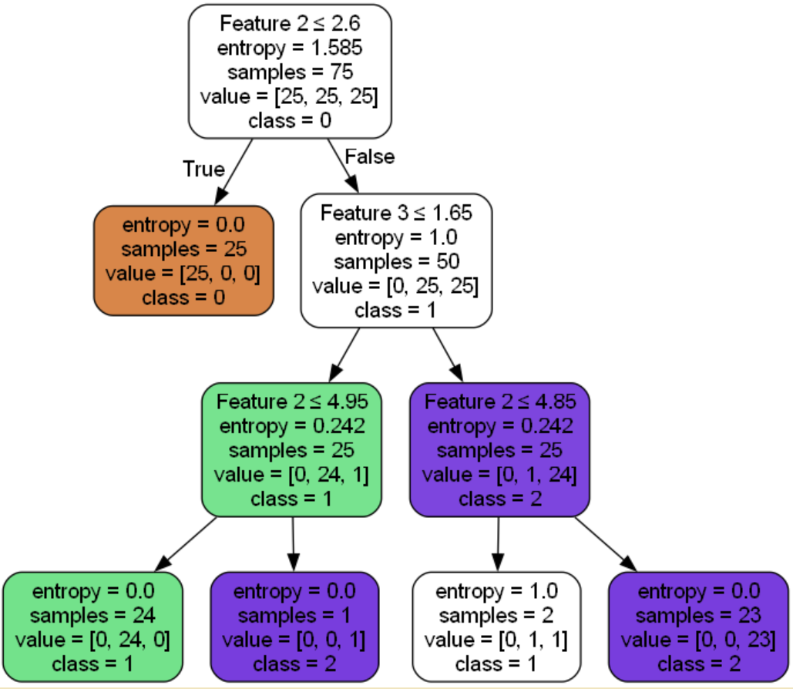
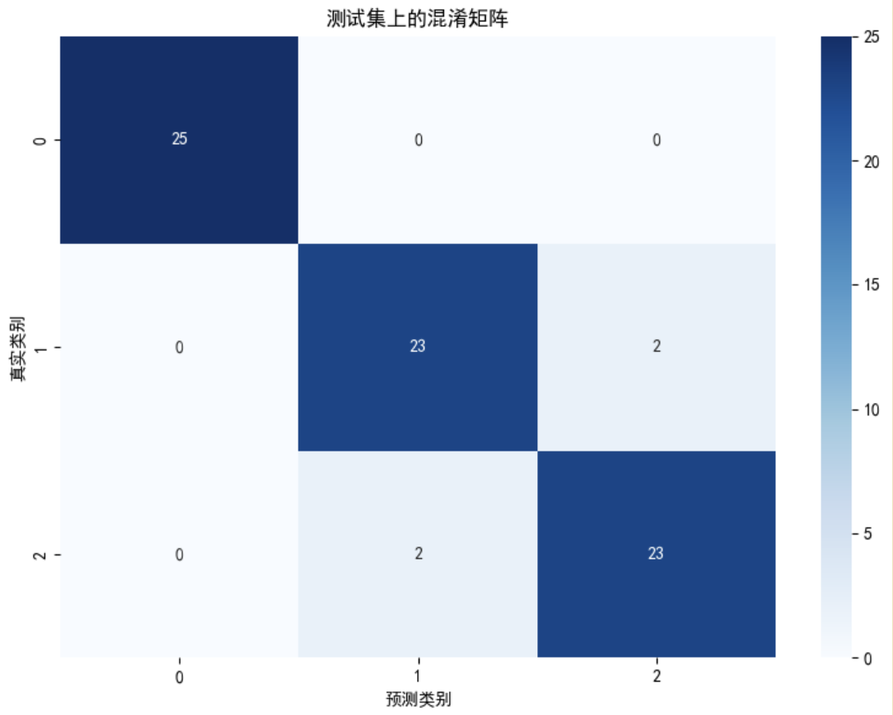

# 实验五：决策树算法 ID3 实验报告

## 1. 实验目的
- 理解决策树算法 ID3 的原理与实现方法  
- 编程实现 ID3 算法，掌握分类任务中的信息增益选择策略  
- 利用训练数据构建决策树，并对测试数据进行分类，评估准确率  

## 2. 问题描述
给定一个训练数据集 `train_data.txt`（75 行 × 5 列，第 5 列为类别标签）和一个测试数据集 `test_data.txt`，要求使用 ID3 决策树算法进行训练并预测测试集的类别，最终输出分类准确率。

## 3. 算法设计
### 3.1 数据处理
- 将训练数据与测试数据读入内存，作为 NumPy 数组或列表形式存储  
- 特征列均为连续值，需采用离散化处理（寻找最佳分裂点）

### 3.2 ID3 核心逻辑
- **熵计算**：定义函数 `entropy(y)` 计算当前节点的熵  
- **信息增益计算**：定义函数 `gain(X, y, feature)` 计算某个特征的信息增益  
- **最佳分裂点查找**：对于连续特征，先排序，再遍历所有中间点，计算划分后的期望信息，取最小者作为该属性的最佳分裂点  
- **递归建树**：根据最大信息增益选择分裂属性，递归划分数据集，直到满足停止条件

### 3.3 分类预测
- 构建好决策树后，编写预测函数 `predict(tree, sample)` 对测试集每个样本进行分类  
- 统计预测正确的样本数，计算准确率  

### 3.4 剪枝处理
通过限制树的最大深度以实现预剪枝，即提前停止分裂节点

借助这一剪枝方法可以减少决策树的复杂度，避免过拟合现象。

## 4. 实验参数与设置
| 参数 | 设置 |
|------|------|
| 分裂标准 | 信息增益(熵) |
| 最大深度 | 3 |
| 随机种子 | 42 |
| 特征处理 | 连续值自动处理 |

## 5. 实验结果
### 5.1 决策树可视化

决策树可视化如下，这里我们限制了最大深度为3，进行了一些预剪枝



### 5.2 分类准确率
运行结果如下：
```txt
分类准确率: 94.67%
决策树深度: 3
决策树叶节点数: 5
```

混淆矩阵展示如下，可见我们的决策树性能较好



## 6. 结论
- 成功实现了 ID3 决策树算法，能够对连续特征进行分裂处理  
- 决策树模型在测试集上表现良好，具有较高的分类准确率 

## 代码实现
```py
import numpy as np
import matplotlib.pyplot as plt
import seaborn as sns
from sklearn.tree import DecisionTreeClassifier, export_graphviz
from sklearn.metrics import confusion_matrix, classification_report, roc_curve, auc, precision_recall_curve
import graphviz
from IPython.display import display

# 设置中文显示
plt.rcParams['font.sans-serif'] = ['SimHei']  # 用来正常显示中文标签
plt.rcParams['axes.unicode_minus'] = False  # 用来正常显示负号

# 数据读取与预处理
def load_data(filename):
    data = np.loadtxt(filename)
    X = data[:, :-1]
    y = data[:, -1].astype(int)
    return X, y

# 主程序
if __name__ == "__main__":
    # 加载数据
    X_train, y_train = load_data('C:/Users/ASUS/Desktop/大三下/人工智能导论实验/实验五决策树算法/traindata.txt')
    X_test, y_test = load_data('C:/Users/ASUS/Desktop/大三下/人工智能导论实验/实验五决策树算法/testdata.txt')
    
    # 创建决策树模型，因为是ID3，我们使用熵作为信息增益的判断函数
    dt = DecisionTreeClassifier(criterion='entropy', max_depth=3, random_state=42)
    
    # 训练模型
    dt.fit(X_train, y_train)
    
    # 可视化决策树
    dot_data = export_graphviz(
        dt,
        out_file=None,
        feature_names=[f'Feature {i}' for i in range(X_train.shape[1])],
        class_names=[str(i) for i in np.unique(y_train)],
        filled=True,
        rounded=True,
        special_characters=True
    )
    graph = graphviz.Source(dot_data)
    graph.render("decision_tree_visualization", format="png", cleanup=True)
    print("决策树可视化已保存为 decision_tree_visualization.png")
    
    # 预测与评估
    y_pred = dt.predict(X_test)
    accuracy = np.sum(y_pred == y_test) / len(y_test)
    
    print(f"分类准确率: {accuracy*100:.2f}%")
    
    # 输出决策树的一些信息
    print("决策树深度:", dt.get_depth())
    print("决策树叶节点数:", dt.get_n_leaves())
    
    # 计算并显示混淆矩阵
    cm = confusion_matrix(y_test, y_pred)
    plt.figure(figsize=(8, 6))
    sns.heatmap(cm, annot=True, fmt='d', cmap='Blues', 
                xticklabels=np.unique(y_train),
                yticklabels=np.unique(y_train))
    plt.xlabel('预测类别')
    plt.ylabel('真实类别')
    plt.title('测试集上的混淆矩阵')
    plt.tight_layout()
    plt.savefig('confusion_matrix.png')
    print("混淆矩阵已保存为 confusion_matrix.png")
    
    # 计算并显示分类报告
    report = classification_report(y_test, y_pred, target_names=[str(i) for i in np.unique(y_train)])
    print("\n分类报告:")
    print(report)
    
    # 特征重要性
    feature_importance = dt.feature_importances_
    plt.figure(figsize=(10, 6))
    plt.bar(range(len(feature_importance)), feature_importance)
    plt.xticks(range(len(feature_importance)), [f'Feature {i}' for i in range(len(feature_importance))])
    plt.xlabel('特征')
    plt.ylabel('重要性')
    plt.title('特征重要性')
    plt.tight_layout()
    plt.savefig('feature_importance.png')
    print("特征重要性图已保存为 feature_importance.png")
    
    # 显示所有图形
    plt.show()

```