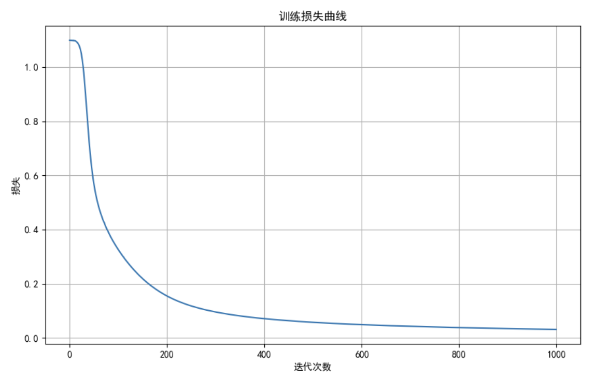
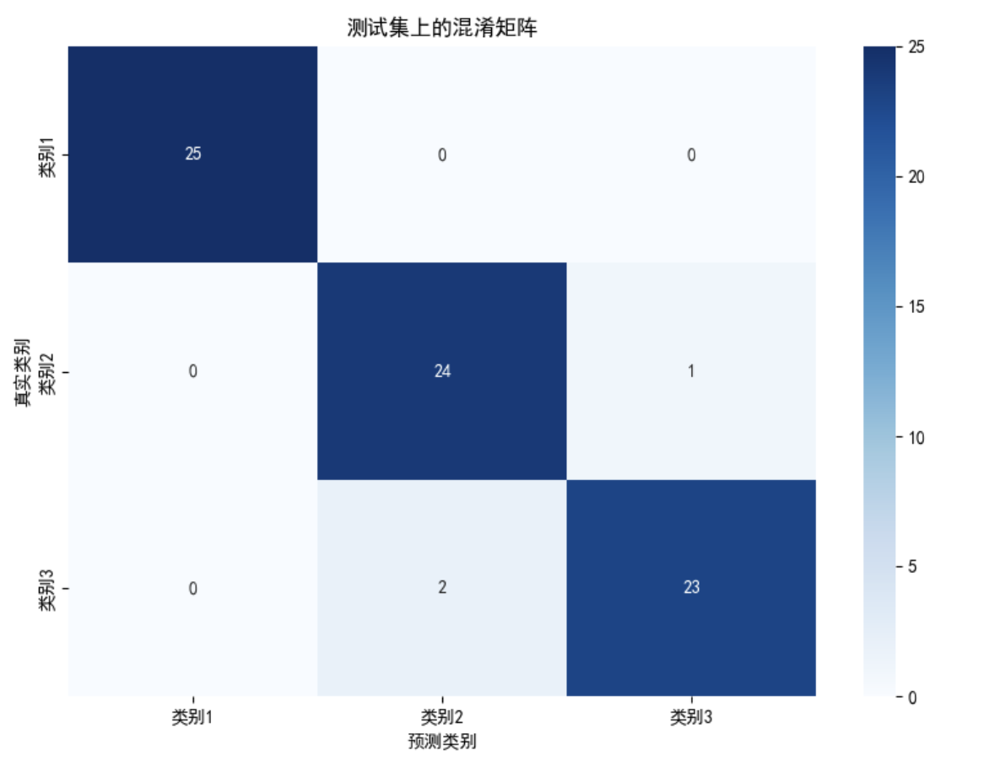
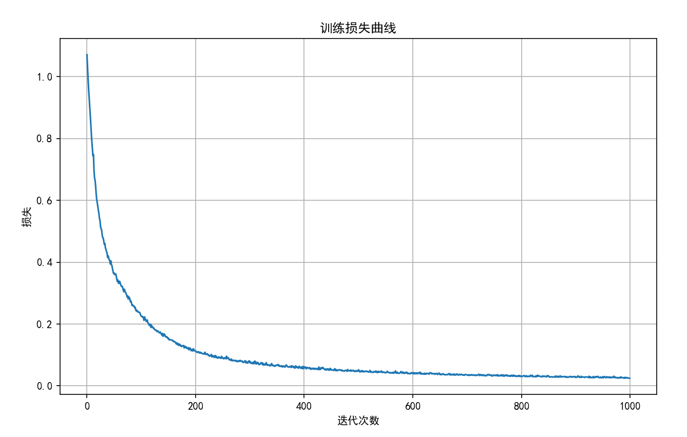

# 实验六：BP神经网络算法实验报告

## 1. 实验目的
- 理解反向传播（BP）神经网络的基本原理与训练过程  
- 掌握使用 BP 算法实现鸢尾花数据集分类的方法  

## 2. 数据集描述
- 使用经典的 **Iris 鸢尾花数据集**，包含 3 类花（Setosa、Versicolor、Virginica），每类各有 50 个样本。
- 每个样本有 4 个特征：萼片长度、萼片宽度、花瓣长度、花瓣宽度。
- 数据集已分为：
  - 训练集 `Iris-train.txt`：75 个样本（每类 25 个）
  - 测试集 `Iris-test.txt`：75 个样本（每类 25 个）
- 标签编码：三类分别编号为 1、2、3。

## 3. 网络结构设计
构建一个三层前馈神经网络，结构如下：

| 层级 | 神经元数量 | 功能 |
|------|------------|------|
| 输入层 | 4 个 | 接收 4 维输入特征 |
| 隐含层 | 10 个 | 使用 Sigmoid 激活函数 |
| 输出层 | 3 个 | 使用 Softmax 函数输出概率分布 |

## 4. 实验参数设置
| 参数 | 值 |
|---------|----------|
| 学习率（learning_rate） | 0.1 |
| 隐含层数量 | 10 |
| 最大迭代次数（epochs） | 1000 |
| 批量大小（batch_size） | 16 |
| 分类数量 | 3 |
| 输出激活函数 | Softmax |
| 损失函数 | 交叉熵损失函数 |
| 优化方式 | 批量梯度下降 |

## 5. 算法流程
1. **初始化网络权重和偏置**：
   - 权重随机初始化（如从均匀分布或正态分布中取值）
   - 偏置初始化为 0 或小的随机数

2. **前向传播**：
   - 输入层 → 隐含层：计算加权和并经过 Sigmoid 激活函数
   - 隐含层 → 输出层：计算加权和并应用 Softmax 得到类别概率

3. **损失计算**：
   - 使用交叉熵损失函数衡量预测值与真实标签之间的误差

4. **反向传播**：
   - 计算损失对输出层权重的梯度
   - 将误差反向传播至隐含层，计算对应梯度
   - 利用链式法则更新权重和偏置

5. **权重更新**：
   - 使用梯度下降法：`weights = weights - learning_rate * gradient`

6. **重复步骤 2~5 直到达到最大迭代次数或收敛**

7. **测试阶段**：
   - 对测试集进行前向传播预测标签
   - 计算准确率

8. **独立运行 10 次，统计平均准确率和标准差**

## 6. 实验结果

### 6.1 单次训练结果示例
```txt
第 0 代，训练损失: 1.0988
第 100 代，训练损失: 0.3252
第 200 代，训练损失: 0.1545
第 300 代，训练损失: 0.0954
第 400 代，训练损失: 0.0708
第 500 代，训练损失: 0.0573
第 600 代，训练损失: 0.0487
第 700 代，训练损失: 0.0425
第 800 代，训练损失: 0.0378
第 900 代，训练损失: 0.0341

测试准确率: 96.00%
训练用时: 0.31 秒
```

### 6.2 独立运行 10 次结果
```txt
开始独立运行10次...
运行 1/10: 准确率 = 96.00%, 用时 = 0.29 秒
运行 2/10: 准确率 = 96.00%, 用时 = 0.31 秒
运行 3/10: 准确率 = 96.00%, 用时 = 0.29 秒
运行 4/10: 准确率 = 96.00%, 用时 = 0.30 秒
运行 5/10: 准确率 = 96.00%, 用时 = 0.29 秒
运行 6/10: 准确率 = 96.00%, 用时 = 0.31 秒
运行 7/10: 准确率 = 96.00%, 用时 = 0.30 秒
运行 8/10: 准确率 = 96.00%, 用时 = 0.36 秒
运行 9/10: 准确率 = 97.33%, 用时 = 0.30 秒
运行 10/10: 准确率 = 96.00%, 用时 = 0.30 秒

10次运行平均准确率: 96.13% ± 0.40%
```

### 6.3 损失曲线图（前 1000 次迭代）



可见从900次迭代后开始，算法逐步收敛
### 6.4 混淆矩阵



可见我们的模型有较好的性能

### 6.5 使用Pytorch的结果
我们还可以使用Pytorch来更快的实现代码，得到的损失曲线图如下



混淆矩阵同上

令人感到意外的是，使用GPU进行训练时用时会比上面我们自己实现的训练要慢，推测对于这种过小规模的数据，CPU和GPU之间的张量传输占用了大部分时间
```txt
第 0 代，训练损失: 1.1046
第 100 代，训练损失: 0.2679
第 200 代，训练损失: 0.1260
第 100 代，训练损失: 0.2679
第 200 代，训练损失: 0.1260
第 200 代，训练损失: 0.1260
第 300 代，训练损失: 0.0804
第 400 代，训练损失: 0.0632
第 500 代，训练损失: 0.0472
第 600 代，训练损失: 0.0409
第 700 代，训练损失: 0.0374
第 800 代，训练损失: 0.0326
第 900 代，训练损失: 0.0278
运行 10/10: 准确率 = 96.00%, 用时 = 5.02 秒

10次运行平均准确率: 96.00% ± 0.00%
10次运行平均用时: 4.98 秒
```

## 代码实现
手搓的BP
```py
import numpy as np
import matplotlib.pyplot as plt
import time
from sklearn.metrics import confusion_matrix, accuracy_score
import seaborn as sns

# 设置中文显示
plt.rcParams['font.sans-serif'] = ['SimHei']  # 用来正常显示中文标签
plt.rcParams['axes.unicode_minus'] = False  # 用来正常显示负号

# 激活函数和它们的导数
def sigmoid(x):
    return 1 / (1 + np.exp(-np.clip(x, -500, 500)))  # 使用clip防止溢出

def sigmoid_derivative(x):
    s = sigmoid(x)
    return s * (1 - s)

def softmax(x):
    exp_x = np.exp(x - np.max(x, axis=1, keepdims=True))  # 减去最大值防止溢出
    return exp_x / np.sum(exp_x, axis=1, keepdims=True)

# 交叉熵损失函数
def cross_entropy_loss(y_pred, y_true):
    m = y_true.shape[0]
    log_likelihood = -np.log(np.sum(y_pred * y_true, axis=1))
    loss = np.sum(log_likelihood) / m
    return loss

# 数据加载函数
def load_data(filename):
    data = np.loadtxt(filename)
    X = data[:, :-1]
    y = data[:, -1].astype(int)  # 类别标签已经是数字格式（0, 1, 2）
    
    # 将类别标签转换为one-hot编码
    y_one_hot = np.zeros((y.size, 3))
    for i in range(y.size):
        y_one_hot[i, y[i]] = 1  # 类别从0开始，直接使用作为索引
    
    return X, y_one_hot, y

# 数据标准化
def standardize(X_train, X_test):
    mean = np.mean(X_train, axis=0)
    std = np.std(X_train, axis=0)
    X_train_std = (X_train - mean) / std
    X_test_std = (X_test - mean) / std
    return X_train_std, X_test_std

# BP神经网络类
class BPNeuralNetwork:
    def __init__(self, input_size, hidden_size, output_size, learning_rate=0.1):
        self.input_size = input_size
        self.hidden_size = hidden_size
        self.output_size = output_size
        self.learning_rate = learning_rate
        
        # 初始化权重和偏置
        self.W1 = np.random.randn(input_size, hidden_size) * 0.01
        self.b1 = np.zeros((1, hidden_size))
        self.W2 = np.random.randn(hidden_size, output_size) * 0.01
        self.b2 = np.zeros((1, output_size))
        
        self.losses = []  # 记录训练损失
        
    def forward(self, X):
        # 前向传播
        self.z1 = np.dot(X, self.W1) + self.b1
        self.a1 = sigmoid(self.z1)
        self.z2 = np.dot(self.a1, self.W2) + self.b2
        self.a2 = softmax(self.z2)
        return self.a2
    
    def backward(self, X, y, output):
        m = X.shape[0]
        
        # 反向传播计算梯度
        dz2 = output - y  # 交叉熵损失对softmax输出的导数
        dW2 = (1/m) * np.dot(self.a1.T, dz2)
        db2 = (1/m) * np.sum(dz2, axis=0, keepdims=True)
        
        dz1 = np.dot(dz2, self.W2.T) * sigmoid_derivative(self.z1)
        dW1 = (1/m) * np.dot(X.T, dz1)
        db1 = (1/m) * np.sum(dz1, axis=0, keepdims=True)
        
        # 更新权重和偏置
        self.W2 -= self.learning_rate * dW2
        self.b2 -= self.learning_rate * db2
        self.W1 -= self.learning_rate * dW1
        self.b1 -= self.learning_rate * db1
    
    def train(self, X, y, epochs=1000, batch_size=16, verbose=True):
        m = X.shape[0]
        
        for epoch in range(epochs):
            # 随机打乱数据
            permutation = np.random.permutation(m)
            X_shuffled = X[permutation]
            y_shuffled = y[permutation]
            
            # 批量梯度下降
            for i in range(0, m, batch_size):
                end = min(i + batch_size, m)
                X_batch = X_shuffled[i:end]
                y_batch = y_shuffled[i:end]
                
                # 前向传播
                output = self.forward(X_batch)
                
                # 反向传播
                self.backward(X_batch, y_batch, output)
            
            # 计算整个训练集的损失
            output = self.forward(X)
            loss = cross_entropy_loss(output, y)
            self.losses.append(loss)
            
            # 打印训练进度
            if verbose and epoch % 100 == 0:
                print(f"第 {epoch} 代，训练损失: {loss:.4f}")
    
    def predict(self, X):
        output = self.forward(X)
        return np.argmax(output, axis=1)  # 类别从0开始
    
    def plot_loss(self):
        plt.figure(figsize=(10, 6))
        plt.plot(self.losses)
        plt.title('训练损失曲线')
        plt.xlabel('迭代次数')
        plt.ylabel('损失')
        plt.grid(True)
        plt.savefig('bp_loss_curve.png')
        print("损失曲线已保存为 bp_loss_curve.png")

# 主函数
def main():
    # 加载数据
    X_train, y_train_one_hot, y_train = load_data('C:/Users/ASUS/Desktop/大三下/人工智能导论实验/实验六反向传播算法/traindata.txt')
    X_test, y_test_one_hot, y_test = load_data('C:/Users/ASUS/Desktop/大三下/人工智能导论实验/实验六反向传播算法/testdata.txt')
    
    # 数据标准化
    X_train_std, X_test_std = standardize(X_train, X_test)
    
    # 创建并训练神经网络
    input_size = X_train.shape[1]  # 4个特征
    hidden_size = 10  # 10个隐藏神经元
    output_size = 3  # 3个输出类别
    
    # 记录训练开始时间
    start_time = time.time()
    
    # 创建神经网络
    nn = BPNeuralNetwork(input_size, hidden_size, output_size, learning_rate=0.1)
    
    # 训练神经网络
    nn.train(X_train_std, y_train_one_hot, epochs=1000, batch_size=16)
    
    # 记录训练结束时间
    end_time = time.time()
    training_time = end_time - start_time
    
    # 在测试集上评估
    y_pred = nn.predict(X_test_std)
    accuracy = accuracy_score(y_test, y_pred)
    print(f"\n测试准确率: {accuracy*100:.2f}%")
    print(f"训练用时: {training_time:.2f} 秒")
    
    # 绘制损失曲线
    nn.plot_loss()
    
    # 计算并显示混淆矩阵
    cm = confusion_matrix(y_test, y_pred)
    plt.figure(figsize=(8, 6))
    sns.heatmap(cm, annot=True, fmt='d', cmap='Blues', 
                xticklabels=['类别1', '类别2', '类别3'],
                yticklabels=['类别1', '类别2', '类别3'])
    plt.xlabel('预测类别')
    plt.ylabel('真实类别')
    plt.title('测试集上的混淆矩阵')
    plt.tight_layout()
    plt.savefig('bp_confusion_matrix.png')
    print("混淆矩阵已保存为 bp_confusion_matrix.png")
    
    # 独立运行10次的结果
    accuracies = []
    times = []
    
    print("\n开始独立运行10次...")
    
    for i in range(10):
        start_time = time.time()
        
        nn = BPNeuralNetwork(input_size, hidden_size, output_size, learning_rate=0.1)
        nn.train(X_train_std, y_train_one_hot, epochs=1000, batch_size=16, verbose=False)
        
        end_time = time.time()
        run_time = end_time - start_time
        
        y_pred = nn.predict(X_test_std)
        acc = accuracy_score(y_test, y_pred)
        
        accuracies.append(acc)
        times.append(run_time)
        
        print(f"运行 {i+1}/10: 准确率 = {acc*100:.2f}%, 用时 = {run_time:.2f} 秒")
    
    # 计算平均准确率和标准差
    mean_accuracy = np.mean(accuracies)
    std_accuracy = np.std(accuracies)
    mean_time = np.mean(times)
    
    print(f"\n10次运行平均准确率: {mean_accuracy*100:.2f}% ± {std_accuracy*100:.2f}%")
    print(f"10次运行平均用时: {mean_time:.2f} 秒")
    
    # 显示所有图形
    plt.show()

if __name__ == "__main__":
    main()
```

torch版
```py
import numpy as np
import matplotlib.pyplot as plt
import time
import torch
import torch.nn as nn
import torch.optim as optim
from torch.utils.data import DataLoader, TensorDataset
from sklearn.metrics import confusion_matrix, accuracy_score
import seaborn as sns

# 设置中文显示
plt.rcParams['font.sans-serif'] = ['SimHei']  # 用来正常显示中文标签
plt.rcParams['axes.unicode_minus'] = False  # 用来正常显示负号

# 设置随机种子以保证结果可复现
torch.manual_seed(42)
np.random.seed(42)

# 数据加载函数
def load_data(filename):
    data = np.loadtxt(filename)
    X = data[:, :-1]
    y = data[:, -1].astype(int)  # 类别标签已经是数字格式（0, 1, 2）
    
    # PyTorch的交叉熵损失函数需要从0开始的类别，这里已经是0开始了
    return X, y

# 数据标准化
def standardize(X_train, X_test):
    mean = np.mean(X_train, axis=0)
    std = np.std(X_train, axis=0)
    X_train_std = (X_train - mean) / std
    X_test_std = (X_test - mean) / std
    return X_train_std, X_test_std

# 定义神经网络模型
class BPNeuralNetwork(nn.Module):
    def __init__(self, input_size, hidden_size, output_size):
        super(BPNeuralNetwork, self).__init__()
        self.layer1 = nn.Linear(input_size, hidden_size)
        self.sigmoid = nn.Sigmoid()
        self.layer2 = nn.Linear(hidden_size, output_size)
        self.softmax = nn.Softmax(dim=1)
        
    def forward(self, x):
        x = self.layer1(x)
        x = self.sigmoid(x)
        x = self.layer2(x)
        # 注意：在使用nn.CrossEntropyLoss时，不需要在forward中应用softmax
        # 因为CrossEntropyLoss已经包含了softmax操作
        return x
    
    def predict(self, x):
        with torch.no_grad():
            x = self.forward(x)
            return torch.softmax(x, dim=1)

# 训练函数
def train_model(model, train_loader, criterion, optimizer, epochs, device):
    model.train()
    losses = []
    
    for epoch in range(epochs):
        epoch_loss = 0
        for inputs, targets in train_loader:
            inputs, targets = inputs.to(device), targets.to(device)
            
            # 前向传播
            outputs = model(inputs)
            loss = criterion(outputs, targets)
            
            # 反向传播和优化
            optimizer.zero_grad()
            loss.backward()
            optimizer.step()
            
            epoch_loss += loss.item()
        
        # 记录每个epoch的平均损失
        avg_loss = epoch_loss / len(train_loader)
        losses.append(avg_loss)
        
        # 打印训练进度
        if epoch % 100 == 0:
            print(f"第 {epoch} 代，训练损失: {avg_loss:.4f}")
    
    return losses

# 评估函数
def evaluate_model(model, test_loader, device):
    model.eval()
    all_preds = []
    all_targets = []
    
    with torch.no_grad():
        for inputs, targets in test_loader:
            inputs, targets = inputs.to(device), targets.to(device)
            outputs = model(inputs)
            _, predicted = torch.max(outputs, 1)
            
            all_preds.extend(predicted.cpu().numpy())
            all_targets.extend(targets.cpu().numpy())
    
    return np.array(all_preds), np.array(all_targets)

# 主函数
def main():
    # 检查是否有可用的GPU
    device = torch.device("cuda:0" if torch.cuda.is_available() else "cpu")
    print(f"使用设备: {device}")
    
    # 加载数据
    X_train, y_train = load_data('C:/Users/ASUS/Desktop/大三下/人工智能导论实验/实验六反向传播算法/traindata.txt')
    X_test, y_test = load_data('C:/Users/ASUS/Desktop/大三下/人工智能导论实验/实验六反向传播算法/testdata.txt')
    
    # 数据标准化
    X_train_std, X_test_std = standardize(X_train, X_test)
    
    # 转换为PyTorch张量
    X_train_tensor = torch.FloatTensor(X_train_std)
    y_train_tensor = torch.LongTensor(y_train)
    X_test_tensor = torch.FloatTensor(X_test_std)
    y_test_tensor = torch.LongTensor(y_test)
    
    # 创建数据加载器
    train_dataset = TensorDataset(X_train_tensor, y_train_tensor)
    train_loader = DataLoader(train_dataset, batch_size=16, shuffle=True)
    
    test_dataset = TensorDataset(X_test_tensor, y_test_tensor)
    test_loader = DataLoader(test_dataset, batch_size=16)
    
    # 模型参数
    input_size = X_train.shape[1]  # 4个特征
    hidden_size = 10  # 10个隐藏神经元
    output_size = 3  # 3个输出类别
    learning_rate = 0.1
    epochs = 1000
    
    # 记录训练开始时间
    start_time = time.time()
    
    # 创建模型
    model = BPNeuralNetwork(input_size, hidden_size, output_size).to(device)
    
    # 定义损失函数和优化器
    criterion = nn.CrossEntropyLoss()
    optimizer = optim.SGD(model.parameters(), lr=learning_rate)
    
    # 训练模型
    losses = train_model(model, train_loader, criterion, optimizer, epochs, device)
    
    # 记录训练结束时间
    end_time = time.time()
    training_time = end_time - start_time
    
    # 在测试集上评估
    y_pred, y_true = evaluate_model(model, test_loader, device)
    
    # 类别已经是从0开始，不需要转换
    # 保持原样
    y_pred = y_pred
    y_true = y_true
    
    accuracy = accuracy_score(y_true, y_pred)
    print(f"\n测试准确率: {accuracy*100:.2f}%")
    print(f"训练用时: {training_time:.2f} 秒")
    
    # 绘制损失曲线
    plt.figure(figsize=(10, 6))
    plt.plot(losses)
    plt.title('训练损失曲线')
    plt.xlabel('迭代次数')
    plt.ylabel('损失')
    plt.grid(True)
    plt.savefig('pytorch_loss_curve.png')
    print("损失曲线已保存为 pytorch_loss_curve.png")
    
    # 计算并显示混淆矩阵
    cm = confusion_matrix(y_true, y_pred)
    plt.figure(figsize=(8, 6))
    sns.heatmap(cm, annot=True, fmt='d', cmap='Blues', 
                xticklabels=['类别1', '类别2', '类别3'],
                yticklabels=['类别1', '类别2', '类别3'])
    plt.xlabel('预测类别')
    plt.ylabel('真实类别')
    plt.title('测试集上的混淆矩阵')
    plt.tight_layout()
    plt.savefig('pytorch_confusion_matrix.png')
    print("混淆矩阵已保存为 pytorch_confusion_matrix.png")
    
    # 独立运行10次的结果
    accuracies = []
    times = []
    
    print("\n开始独立运行10次...")
    
    for i in range(10):
        # 重置随机种子以确保不同的初始化
        torch.manual_seed(i)
        np.random.seed(i)
        
        start_time = time.time()
        
        # 创建新模型
        model = BPNeuralNetwork(input_size, hidden_size, output_size).to(device)
        optimizer = optim.SGD(model.parameters(), lr=learning_rate)
        
        # 训练模型
        train_model(model, train_loader, criterion, optimizer, epochs, device)
        
        end_time = time.time()
        run_time = end_time - start_time
        
        # 评估模型
        y_pred, y_true = evaluate_model(model, test_loader, device)
        y_pred = y_pred + 1
        y_true = y_true + 1
        
        acc = accuracy_score(y_true, y_pred)
        
        accuracies.append(acc)
        times.append(run_time)
        
        print(f"运行 {i+1}/10: 准确率 = {acc*100:.2f}%, 用时 = {run_time:.2f} 秒")
    
    # 计算平均准确率和标准差
    mean_accuracy = np.mean(accuracies)
    std_accuracy = np.std(accuracies)
    mean_time = np.mean(times)
    
    print(f"\n10次运行平均准确率: {mean_accuracy*100:.2f}% ± {std_accuracy*100:.2f}%")
    print(f"10次运行平均用时: {mean_time:.2f} 秒")
    
    # 显示所有图形
    plt.show()

if __name__ == "__main__":
    main()

```