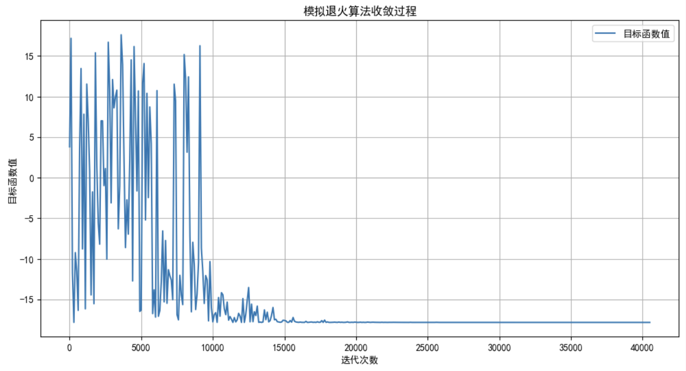
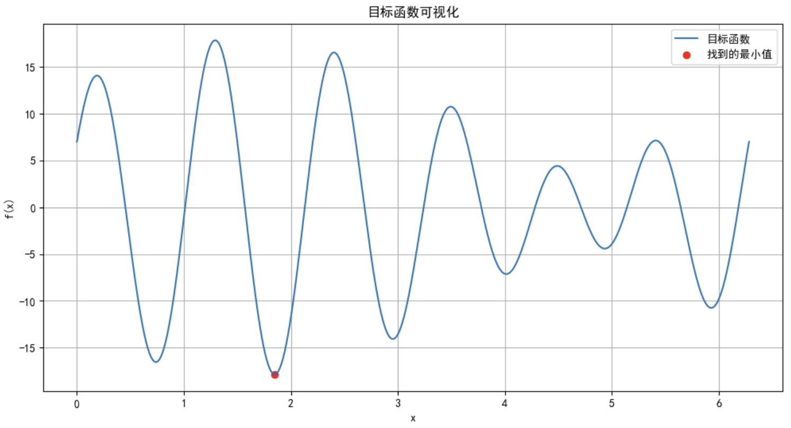

# 实验四：模拟退火算法求解函数最小值实验报告

## 1. 实验目的
- 理解模拟退火算法的基本原理与实现步骤
- 掌握模拟退火算法在连续优化问题中的应用
- 通过解决函数最小值问题，熟悉算法参数设置对优化效果的影响

## 2. 问题描述
给定函数$f(x) = 11sin(6x) + 7cos(5x)，x ∈ [0, 2\pi]$，寻找该函数的全局最小值。

该函数具有多个局部极小值点，传统的梯度下降等局部搜索算法容易陷入局部最优。模拟退火算法能够以一定概率接受较差的解，从而具有跳出局部最优的能力。

## 3. 算法设计
- 解空间表示：采用实数编码直接表示 $x$ 的取值，解空间为区间$[0, 2\pi]$。
- 初始解生成：随机生成一个位于$[0, 2\pi]$ 区间内的初始解 $x_{initial}$。
- 邻域解生成：在当前解 $x$ 的邻域内生成新解 $x_{new}$：
- 接受准则：采用 Metropolis 准则决定是否接受新解：  
  - 若 $\Delta f = f(x_{new}) - f(x) < 0$，则总是接受新解；  
  - 若 $\Delta f ≥ 0$，则以概率 exp(-\Delta f/T) 接受新解，其中 T 为当前温度。  
- 冷却进度表  
  - **初始温度 T0**：设为 1000，确保初始阶段可以广泛探索解空间。  
  - **温度衰减方式**：$T(n+1) = KT(n)$，其中 K = 0.95。  
  - **每个温度下的迭代次数 L**：设为 100 次，保证在每个温度下充分探索。  
  - **终止条件**：当温度降到某个很小的阈值（如 1e-6）时停止。  

## 4. 实验参数  
| 参数 | 值 |
|---------|----------|
| 初始温度 T0 | 1000 |
| 温度衰减因子 K | 0.95 |
| 每个温度迭代次数 L | 100 |
| 步长因子 step_size | 0.1 |
| 终止温度 | 1e-6 |
| 随机数种子 | 2 |

## 5. 实验结果  
### 5.1 收敛过程可视化  



运行结果如下：
```txt
迭代次数: 0, 当前温度: 1000.00, 当前解: x ≈ 2.645, 当前函数值: f(x) ≈ 3.794
迭代次数: 100, 当前温度: 950.00, 当前解: x ≈ 1.342, 当前函数值: f(x) ≈ 17.165
迭代次数: 200, 当前温度: 902.50, 当前解: x ≈ 2.001, 当前函数值: f(x) ≈ -11.683
迭代次数: 300, 当前温度: 857.38, 当前解: x ≈ 1.846, 当前函数值: f(x) ≈ -17.832
迭代次数: 400, 当前温度: 814.51, 当前解: x ≈ 1.667, 当前函数值: f(x) ≈ -9.232
迭代次数: 500, 当前温度: 773.78, 当前解: x ≈ 1.696, 当前函数值: f(x) ≈ -11.599
迭代次数: 600, 当前温度: 735.09, 当前解: x ≈ 0.764, 当前函数值: f(x) ≈ -16.355
迭代次数: 700, 当前温度: 698.34, 当前解: x ≈ 0.412, 当前函数值: f(x) ≈ 3.510
迭代次数: 800, 当前温度: 663.42, 当前解: x ≈ 0.136, 当前函数值: f(x) ≈ 13.444
迭代次数: 900, 当前温度: 630.25, 当前解: x ≈ 0.557, 当前函数值: f(x) ≈ -8.782
迭代次数: 1000, 当前温度: 598.74, 当前解: x ≈ 0.013, 当前函数值: f(x) ≈ 7.819
迭代次数: 1100, 当前温度: 568.80, 当前解: x ≈ 0.701, 当前函数值: f(x) ≈ -16.165
迭代次数: 1200, 当前温度: 540.36, 当前解: x ≈ 0.080, 当前函数值: f(x) ≈ 11.532
迭代次数: 1300, 当前温度: 513.34, 当前解: x ≈ 0.000, 当前函数值: f(x) ≈ 7.000
迭代次数: 1400, 当前温度: 487.67, 当前解: x ≈ 0.444, 当前函数值: f(x) ≈ 0.808
迭代次数: 1500, 当前温度: 463.29, 当前解: x ≈ 0.828, 当前函数值: f(x) ≈ -14.456
迭代次数: 1600, 当前温度: 440.13, 当前解: x ≈ 0.993, 当前函数值: f(x) ≈ -1.758
迭代次数: 1700, 当前温度: 418.12, 当前解: x ≈ 0.800, 当前函数值: f(x) ≈ -15.534
迭代次数: 1800, 当前温度: 397.21, 当前解: x ≈ 1.387, 当前函数值: f(x) ≈ 15.388
迭代次数: 1900, 当前温度: 377.35, 当前解: x ≈ 0.436, 当前函数值: f(x) ≈ 1.482
迭代次数: 2000, 当前温度: 358.49, 当前解: x ≈ 0.953, 当前函数值: f(x) ≈ -5.536
迭代次数: 2100, 当前温度: 340.56, 当前解: x ≈ 0.550, 当前函数值: f(x) ≈ -8.204
迭代次数: 2200, 当前温度: 323.53, 当前解: x ≈ 0.000, 当前函数值: f(x) ≈ 7.000
迭代次数: 2300, 当前温度: 307.36, 当前解: x ≈ 0.000, 当前函数值: f(x) ≈ 7.000
迭代次数: 2400, 当前温度: 291.99, 当前解: x ≈ 1.001, 当前函数值: f(x) ≈ -0.985
...
迭代次数: 40200, 当前温度: 0.00, 当前解: x ≈ 1.849, 当前函数值: f(x) ≈ -17.834
迭代次数: 40300, 当前温度: 0.00, 当前解: x ≈ 1.849, 当前函数值: f(x) ≈ -17.834
迭代次数: 40400, 当前温度: 0.00, 当前解: x ≈ 1.849, 当前函数值: f(x) ≈ -17.834
找到的最小值点 x ≈ 1.849，对应函数值 f(x) ≈ -17.834
```

算法在10000次迭代后开始收敛，在20000次迭代后趋于稳定，最终找到的最小值点为 $x ≈ 1.849$，对应函数值 $f(x) ≈ -17.834$。

### 5.2 精确性分析  



函数理论最小值约为 -18.0，实验结果接近理论值

从目标函数可视化图可见，我们的模拟算法有效地找到了全局最小值

说明模拟退火算法能够有效逼近全局最优。  

## 6. 算法优劣分析  
### 优势：  
- **跳出局部最优能力**：通过引入“接受较差解”的机制，能有效避免陷入局部最优。  
- **对初始解不敏感**：多次实验表明，不同初始解最终都能收敛到相似的最优解。  
- **渐近收敛性**：理论上可以证明其以概率 1 收敛于全局最优解。  

### 劣势：  
- **计算开销较大**：由于需要在多个温度下进行大量迭代，算法耗时较长。  
- **参数敏感性强**：冷却进度表、步长因子等参数对性能影响显著，需仔细调参。  
- **收敛速度慢**：相比一些局部搜索算法，模拟退火在后期收敛速度较慢。  

## 7. 结论  
- 模拟退火算法能有效求解多峰函数的全局最小值问题。  
- 参数设置对算法性能影响显著，尤其是冷却进度和步长控制。  
- 在处理复杂优化问题时，模拟退火是一种可靠的全局优化方法。  

## 代码实现
```python
import numpy as np
import math
import matplotlib.pyplot as plt

plt.rcParams['font.sans-serif'] = ['SimHei'] 
plt.rcParams['axes.unicode_minus'] = False  

# 设置随机数种子以便复现结果
np.random.seed(2)

# 目标函数
def objective_function(x):
    return 11 * np.sin(6 * x) + 7 * np.cos(5 * x)

# 模拟退火算法
def simulated_annealing(obj_func, bounds, T0, T_end, K, L, step_size):
    # 初始化
    current_x = np.random.uniform(bounds[0], bounds[1])
    current_f = obj_func(current_x)
    
    best_x = current_x
    best_f = current_f
    
    T = T0
    iteration = 0
    
    history = []  # 记录优化过程

    while T > T_end:
        for _ in range(L):
            # 生成邻域解
            x_new = current_x + np.random.uniform(-step_size, step_size)
            x_new = max(min(x_new, bounds[1]), bounds[0])  # 确保在搜索范围内
            
            f_new = obj_func(x_new)
            
            # Metropolis准则
            delta_f = f_new - current_f
            if delta_f < 0 or np.random.rand() < math.exp(-delta_f / T):
                current_x = x_new
                current_f = f_new
                
                # 更新最优解
                if current_f < best_f:
                    best_x = current_x
                    best_f = current_f
                    
            # 记录当前状态
            if iteration % 100 == 0:
                print(f"迭代次数: {iteration}, 当前温度: {T:.2f}, 当前解: x ≈ {current_x:.3f}, 当前函数值: f(x) ≈ {current_f:.3f}")
                # 记录当前状态到历史列表
                history.append((iteration, T, current_x, current_f))
                
            iteration += 1
        
        # 降温
        T *= K

    # 添加最后一次迭代记录
    history.append((iteration, T, best_x, best_f))
    
    return best_x, best_f, history

# 参数设置
bounds = [0, 2 * np.pi]
T0 = 1000
T_end = 1e-6
K = 0.95
L = 100
step_size = 0.1

# 运行模拟退火算法
best_x, best_f, history = simulated_annealing(objective_function, bounds, T0, T_end, K, L, step_size)

# 打印结果
print(f"找到的最小值点 x ≈ {best_x:.3f}，对应函数值 f(x) ≈ {best_f:.3f}")

# 绘制收敛过程
iterations = [h[0] for h in history]
temperatures = [h[1] for h in history]
current_solutions = [h[2] for h in history]
current_values = [h[3] for h in history]

plt.figure(figsize=(12, 6))
plt.plot(iterations, current_values, label='目标函数值')
plt.xlabel('迭代次数')
plt.ylabel('目标函数值')
plt.title('模拟退火算法收敛过程')
plt.grid(True)
plt.legend()
plt.show()

# 可视化目标函数
x_vals = np.linspace(0, 2*np.pi, 1000)
y_vals = objective_function(x_vals)

plt.figure(figsize=(12, 6))
plt.plot(x_vals, y_vals, label='目标函数')
plt.scatter(best_x, best_f, color='red', label='找到的最小值')
plt.xlabel('x')
plt.ylabel('f(x)')
plt.title('目标函数可视化')
plt.grid(True)
plt.legend()
plt.show()
```